# Contents

1. [A Brief Overview](#clunks---a-brief-overview)
    1. [The Plan](#the-plan)
    2. [Feasibility](#feasibility)
    3. [Objectives](#objectives)
2. [The Design](#clunks---the-design)
    1. [The Proposed System - Servers](#the-proposed-system---servers)
    2. [The Proposed System - Client Side Usage](#the-proposed-system---client-side-usage)
    3. [Major Components](#major-components)
    4. [Database Design](#database-design)
    5. [Class Design - Channels](#class-design---channels)
    6. [Class Design - Program.cs](#class-design---programcs)
    7. [Class Design - Programmatic Database Interaction](#class-design---programmatic-database-interaction)
    8. [Complex Data Processing - Entity Tracing](#complex-data-processing---entity-tracing)
    9. [Class Design - Message Feed](#class-design---message-feed)
    10. [ClunksEXP](#clunksexp)
    11. [UI Design](#ui-design)
3. [A Guided Tour](#clunks---a-guided-tour)
    1. [Creating an EXP](#creating-an-exp)
    2. [Importing an EXP](#importing-an-exp)
    3. [Communicating Over the Network](#)
    4. [The Client](#the-client)
    5. [Dependencies](#dependencies)
4. [The Testing](#clunks---the-testing)
    1. [CPU Performance - Thread Sleeping](#cpu-performance---thread-sleeping-on-continuous-threads)
    2. [Entity Traversal](#entity-traversal)
    3. [Message Feed](#message-feed)
5. [Evaluation](#clunks---evaluation)
    1. [Objective Review](#objective-review)
    2. [Overall Evaluation](#overall-evaluation)
    3. [Future Improvements](#future-improvements)
    4. [Known Issues](#know-issues)
    5. [Closing Remarks](#closing-remarks)

---

# **CLUNKS** - A Brief Overview

***C**ommand **L**ine **U**nification **N**etwork **S**ystem*

**CLUNKS** is a system to provide simple LAN communication services for large businesses and establishments. Users will need to create a CLUNK Server on their network, and from there, the clients can log into pre-made user accounts, which can use to host, join logical entities on the server to communicate with any users added to it. **CLUNKS** currently runs with messaged based communication but has the underlying framework in place to be compatible with video and audio communication as well.

While other similar programs may exist, they are usually bespoke softwares made privately for specific environments and aren't designed to be public and widely accessible like **CLUNKS** is. This means that they may not have the same security and performance benefits that come built into **CLUNKS**, and the ones which do are often private or proprietary.

Some other programs achieve a similar result (provide communication between users on different machines) but in different ways (non-CLI). Skype and Microsoft Teams are good examples of some of these. Both are Microsoft-developed applications to provide communication services with Skype being aimed for more personal usage and Microsoft Teams targeting a professional setting. While both applications work very well and could be used in place of **CLUNKS** to achieve its task, there is often much overhead to using these programs - being that an account has to be opened with Microsoft and lots of verification has to be put in place to protect this account, etc. **CLUNKS** aims to solve this problem by simplifying the process and removing all the unnecessary extra parts of the solution so that the user doesn't have to worry about them. This makes the system easy to set up and very accessible to new users.

**CLUNKS** is created with inclusion in mind and aims to create a satisfying user experience for all machines, regardless of the power of the machine running the client. While this approach applies to the server also, the operation of **CLUNKS** can benefit largely from having the server running on a more powerful machine. Other services may not share this philosophy, making **CLUNKS** great for quickly getting a system up and running for fast and secure communication in any environment.

## The Plan

The overall service will be broken down into three distinct executable programs. First the client, a C# .NET5 Console Application that will connect to the server provides a user with all the means necessary to communicate with other users on the server. 

Then there is the server program itself. The server is a C# ASP.NET Worker Service that can be built down into a Windows Service or daemon (appropriate to the operating system of the build machine) and executed once to run for long periods, and serve clients. The server will manage the user database and also will act as a secure 'middle-man' for the encryption so that users only ever need to store one asymmetric key (managed by the client program). While the default server and client are written in C#, all the server program does is expose a socket on its machine and process the data coming into that socket in a certain way. This means that theoretically, any program could be created in any language to connect to a CLUNK Server, so long as it followed the correct protocols and presented data in the right way (otherwise the new client would be rejected by the server). In a practical sense, the possibilities could range from a user creating their simplified version of the **CLUNKS** client; to a user intergrating **CLUNKS** into a whole different application, so long as they had access to a server. Likewise, along with the server being openly accessible, the server is written abstract enough that it could be implemented into a WAN - despite being targeted for a LAN configuration. This would simply involve hosting a CLUNKS Server on a web server machine, allowing it to be accessed by any client with an internet connection. 

Finally, there is the support program: ClunksEXP. The server is configured using `.exp` files, which are a configuration on `XML` that allows users to configure user accounts, entities on the server and different user privileges. When the server is run, it can be told to load an `.exp` configuration into itself, which it will do, reconfiguring the server to whatever was defined in the `.exp` file. This not only makes different configurations easy and quick to change but also makes them easy to share. If the server ran solely from a database file, the only way a configuration could be used twice is if the database was reconstructed, which could easily become a long and tedious task; or copied and shared, which could potentially take up very large amounts of disk space. `.exp` files are lightweight and can be created and edited within ClunksEXP, making server configuration and reconfiguration simple and easy and allowing server admins to easily share configurations if they wish to do so.

ClunksEXP is written in Python, a scripting language that best suits the objective the program is trying to achieve. The client and program are both written in cross-platform compatible languages, making **CLUNKS** as a whole a completely cross-platform service that can run on Windows, Linux and MacOS.

## Feasibility

>*i.* The user hardware requirements for service are very feasible since **CLUNKS** is designed to run well on any system. Furthermore, in a LAN setting, a stable internet connection wouldn't even be required so long as there is a network for devices to connect to. The service could even be run in remote locations! <br> <br>
>*ii.* In terms of comparing **CLUNKS** to other similar software solutions, there isn't much of a jump for users to adapt to between the currently available systems and what **CLUNKS** aims to be. It should be simple to use and approachable to new users, making the change very feasible. <br> <br>
>*iii.* The processing issues of the solution (from a programming perspective) aren't necessarily simple, but possible, and since all major potential feasibility issues have been considered, the project can be considered to be feasible in terms of coding, production and usage.

## Objectives

**CLUNKS** aims to:
- Contain functionality that will allow users to communicate with each other via messages
- Provide a smooth user experience by utilising threads to distribute the workload across multiple asynchronous paths of execution
- Provide secure communication by encrypting all network traffic sent through it
- Provide absolute confidence of integrity of data
- Provide fast communication services
- Be a service that can run smoothly on any machine, regardless of its performance grade (within reason)
- Provide a flexible underlying codebase that can be expanded for more features in the future such as audio and video calling
- Provide unique user accounts used to perform actions within the program
- Provide an application allowing users to easily create and configure their server to their specific needs

<br>

--------
<br>

# **CLUNKS** - The Design 

## The Proposed System - Servers

For new **CLUNKS** installations, a new CLUNK Server will need to be started to get the system up and running. Using ClunksEXP, a user can create `.exp` files to create the configuration they want to run the server on. This file can then be loaded into the server when it starts up and the server can be left running to serve users. The `.exp` file will contain the information for user accounts, and hosted entities.

The available hosted entities, in hierarchical order, are:
 - Sub-servers
 - Rooms
 - Groups

Sub-servers are the (hierarchically) greatest entity that can be created on the server. They are created directly on the server and are used to create separation within different groups of users within the server. Each sub-server be represented with separate tables in the database, such that a user registered to a sub-server, will not exist in any other sub-server unless they are created in the other sub-servers also. Providing the admin of the CLUNK Server the ability to create separation within the server. For example, a school using CLUNKS may create separate subservers for each year group.

Like sub-servers, rooms are also entities that can exist on a CLUNK Server, with the difference between a sub-server and room being that rooms cannot be created directly onto the server, while sub-servers can. Sub-servers however, cannot be created anywhere other than directly on the server. This means that any complex structures required by the server admin can be created using rooms, which must be a child of a sub-server or another room. In the school example used above, rooms could be used to represent different classes within the year groups. Rooms can also be password protected.

Finally, groups are temporary rooms that can be created by clients on the server. Unlike sub-servers and rooms, groups can only be created at runtime, so aren't included in the `.exp` specification of a CLUNKS server. They serve the purpose of allowing the user to make privatised spaces on the parent entity without needing to permanently impact the structure of the server. The member-list of the group is the same as the member list of the groups' parent and the room must be the child of a room or another group. Privatisation is achieved with the (optional) password that a room can be created with such that the password will only be shared with the desired users, and only they can connect to the room. After being created, the group will exist until all its members quit the program. If they leave the group but still have the program open, the group will be kept alive until the last group member quits the program.

The server admin can also create *global users*. These are users who are not tied to one specific sub-sever but exist globally to the entire server. In the school scenario, this would be used to create accounts for teachers, since it allows the admin to create the user account for a teacher once, rather than repeatedly duplicating the same account for each year group sub-sever.

The ability to run commands within CLUNKS is controlled by the server admin. The server-admin can grant different permissions to different users which will allow them to do certain things. In the school example, the server admin may configure the server such that only teachers can create groups, and students may only join existing ones. To achieve this, they would create an *elevation level* (one for the student and one for the teacher). Elevation levels describe the actions that a user is allowed to make. The teacher elevation level would have the ability to make calls, the student one would not. These elevation levels can then be assigned from within ClunksEXP to the users as the admin sees fit.

The Server will contain an XML `App.config` file, that can be edited by users to change the behaviour of the CLUNK Server on startup. The configuration file looks like this:

```xml
<?xml version="1.0"?>
<configuration>
  <connectionStrings>
    <add name="default" connectionString="Data Source={0}\data.db;Cache=Shared"/>
  </connectionStrings>

  <appSettings>
    <add key="bufferSize" value="1024" />
    <add key="username" value="admin" />
    <add key="password" value="$2a$11$7AGg3IqlUDW94AF3Yn3CMOMv4EoHV0UFtpspasMx80DGDyxljxDk2"/>
    <add key="ipaddress" value="192.168.0.21"/>
    <add key="tcpPort" value="40000"/>
    <add key="udpPort" value="30000"/>
    <add key="dataPath" value=""/>
    <add key="newExp" value="true"/>
  </appSettings>
</configuration>
```

The values of any `add` elements defined within this file can be edited by the admin of a CLUNK Server.

## The Proposed System - Client Side Usage

As the name suggests, **CLUNKS**, is a command-line application, the recommended usage is for a user to add **CLUNKS** to their environment variables so they can call the client program from their command prompt/terminal.

To run the program, users will call `clunks [serverIP] [serverTCPPort] [serverUDPPort]`, (or whatever the program is named in the user's environment variables). They can tell they're in the **CLUNKS** environment as their command prompt/terminal will change to:
```
CLUNKS>>>
```
***CLUNKS** commands are not case sensitive*

### **Logging in**
Most actions require the user to be logged into their account. This can be done with:

```
CLUNKS>>> login [username]
```
If a user with the provided username exists within CLUNKS, the server will reply with:
```
CLUNKS>>> Enter your password:
```
On successful login, the header will update to include the user's username:
```
'[username]'
CLUNKS>>>
```
After the initial login, one of the first things a user might want to do is change their password from whatever was assigned to them by the admin, they can do this with:
```
CLUNKS>>> changepwd [old password] [new password]
```

### **Connecting**
To interact with other active users on the server, the user will need to enter the entities that the other users are in. This can be done with:
```
CLUNKS>>> connect [targetEntityName]
```
*The server may request a password for the entity if one has been set.*
On successful login, the header will update to include the user's current location:
```
'[username]' @ [location]
CLUNKS>>>
```

### **Groups**
```
CLUNKS>>> makegrp [roomname] [password]
```
*Where [password] is optional*

After this, the group can be joined using the standard `connect` command. 

### **Messaging**
Messaging is another base feature of CLUNKS. Users can message each other directly with:
```
CLUNKS>>> chat [username] [message]
```
This will send a message to the user. Messages are stored in the database. A user can send a message to all members of the entity with:
```
CLUNKS>>> chat @[entityname] [message]
```
To see incoming messages, users can use the `feed` command to display a message feed onto the console:
```
CLUNKS>>> feed
========================[INCOMING FEED - (LIVE)]=========================


=========================================================================
CLUNKS>>> 
```
The user can then continue to use **CLUNKS** as usual. When messages are received, they will populate the feed. The feed can be scrolled with `CRTL` + `UP/DOWN`. The feed will output itself to fit the size of the console at the time `feed` was run. It will deactivate itself when offscreen. In inactive feed will say `[FEED - (DEACTIVATED)]` in the header instead of `[INCOMING FEED - (LIVE)]`. If the user is currently scrolled up and a new message comes in, the feed will alert the user that new messages are available by updating the header to `[INCOMING FEED - (▼)]`.

### **Calling**
After a user has entered the sub-server, they can create calls. To call another user, they can run:
```
CLUNKS>>> call [username]
```
This will send a call to the desired user, which can be accepted or rejected by them. Call requests look like this:
```
CLUNKS>>> [username] is calling. Accept?
```
The user can enter `y` to accept or `n` to decline. After three seconds with no response, the request is repeated. Requests are repeated 5 times until they are automatically quit. The original user would be informed that the call was not picked up. The intended receiver would have notification added to their notifications if they missed the call.

For large conference calls, the user can also create a call on their current entity server by running the `call` command with no username. This creates a conference call that anyone on the subserver can join into by running `joincall`. There can only be one call running in a given entity at a time.

### **Call Actions**
When in large group calls, the screen may become crowded by camera feeds of all the other users. To manage this, the user can use `hide [username]` and `show [username]` to toggle which users are shown. When a user is hidden, you can only hear them, but not see. A user in a call can be silenced with `mute [username]`. `mute` can be undone with `unmute`. These commands only apply to the user that runs them Running `mute` or `unmute` with no argument will perform the action on the user. This will be applied to everyone.

### **Info Commands**
There are commands that users can run to obtain information about the subserver. 

*Self:* `self` will show the information of the user who calls it, it can show things like granted permissions, joined rooms, number of calls, etc. Running `self` during a call will show whether the user is muted and if their camera is showing.

*Structure:* `structure` will show the structure of the current sub-server, in a tree-type view. This includes any rooms and groups that haven't been marked as hidden.

*Notifications:* `notifications` will show any notifications the user has from the server, such as missed calls. The user can clear their notifications, otherwise, all uncleared notifications will be loaded when the command is run.

*Stats:* `stats` will show logged statistics to the user. This can include information such as processed packets per second; how many UDP datagrams are too large for the buffer size as a percentage, etc. The user can use these statistics to make informed decisions on which settings to set in `settings`.

*Settings:* `settings` will allow the user to configure the program to run differently to optimise efficiency and improve the user experience for them.

---

## Major Components
The C# code will be written in Microsoft Visual Studio (A C# supporting IDE) that organises projects into 'Solutions' and 'Projects'. A VS Project represents an entire C# assembly, a solution is a collection of projects and related data. The client and server programs will be written as individual projects in the overall solution. The solution will also contain another project 'Common', containing the classes shared between the client and server projects.

## Database Design

For the CLUNK Server to keep track of its data, it stores data in a SQLite database that will be created on the disk of the server machine. SQLite was chosen in mind of the accessibility that CLUNKS tries to achieve. Other variations of SQL databases would require a database engine to be installed and running on the server machine. While this can be beneficial in some places, it can make setting up an application much more complicated and difficult to set up, likewise, a solid understanding of databases is often required to troubleshoot the many problems that can occur with these systems. SQLite works differently from these variations and is instead a self-contained full database management package, requiring no external dependencies to be installed and configured along with it. This not only simplifies CLUNKS from a development perspective but also a usage perspective, making the setup of a CLUNKS server quick and easy.

Below is an entity-relationship diagram displaying the structure of the database and the relationships of the entities within it. The lines between field names show the foreign key relationships, primary keys are highlighted in bold:

*NOTE: The database will be a SQLite database but the diagram shows some non-SQLite datatypes*

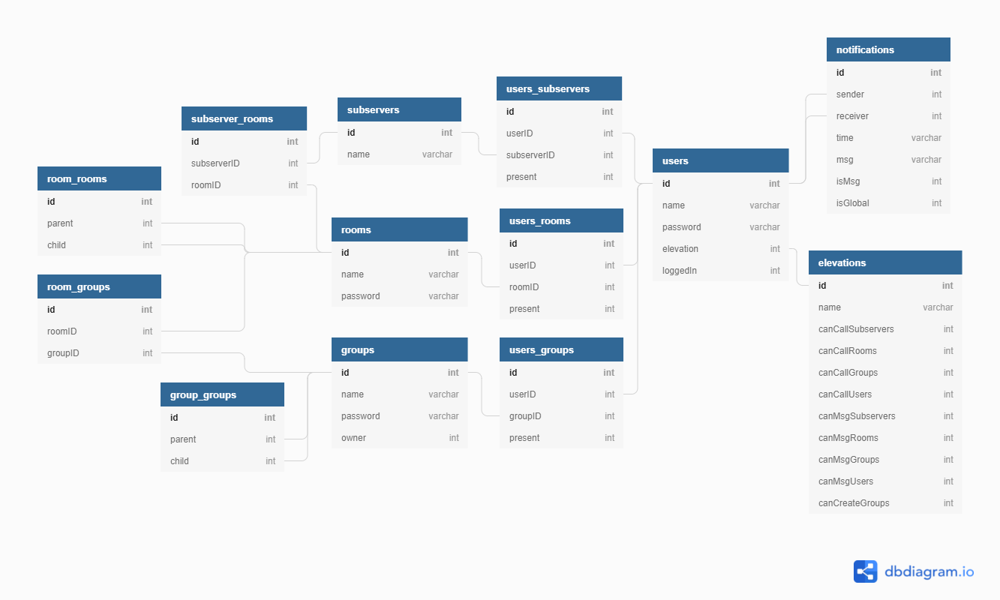
[*Raw view here*](https://raw.githubusercontent.com/lembn.github.io/master/docs/CLUNKS/README_img/dbschema.png)

<!--TABLE elevations {-->
 <!--id int PK-->
 <!--name varchar-->
 <!--canCallSubservers int-->
 <!--canCallRooms int-->
 <!--canCallGroups int-->
 <!--canCallUsers int-->
 <!--canMsgSubservers int-->
 <!--canMsgRooms int-->
 <!--canMsgGroups int-->
 <!--canMsgUsers int-->
 <!--canCreateGroups int-->
<!--}-->
<!--TABLE subservers {-->
 <!--id int PK-->
 <!--name varchar-->
<!--}-->
<!--TABLE rooms {-->
 <!--id int PK-->
 <!--name varchar-->
 <!--password varchar-->
<!--}-->
<!--TABLE subserver_rooms {-->
 <!--id int PK-->
 <!--subserverID int-->
 <!--roomID int-->
<!--}-->
<!--TABLE room_rooms {-->
 <!--id int PK-->
 <!--parent int-->
 <!--child int-->
<!--}-->
<!--TABLE users {-->
 <!--id int PK-->
 <!--name varchar-->
 <!--password varchar-->
 <!--elevation int-->
 <!--loggedIn int-->
<!--}-->
<!--TABLE users_subservers {-->
 <!--id int PK-->
 <!--userID int-->
 <!--subserverID int-->
 <!--present int-->
<!--}-->
<!--TABLE users_rooms {-->
 <!--id int PK-->
 <!--userID int-->
 <!--roomID int-->
 <!--present int-->
<!--}-->
<!--TABLE groups {-->
 <!--id int PK-->
 <!--name varchar-->
 <!--password varchar-->
 <!--owner int-->
<!--}-->
<!--TABLE room_groups {-->
 <!--id int PK-->
 <!--roomID int-->
 <!--groupID int-->
<!--}-->
<!--TABLE group_groups {-->
 <!--id int PK-->
 <!--parent int-->
 <!--child int-->
<!--}-->
<!--TABLE users_groups {-->
 <!--id int PK-->
 <!--userID int-->
 <!--groupID int-->
 <!--present int-->
<!--}-->
<!--TABLE notifications {-->
 <!--id int PK-->
 <!--sender int-->
 <!--receiver int-->
 <!--time varchar-->
 <!--msg varchar-->
 <!--isMsg int--> 
 <!--isGlobal int--> 
<!--}-->

<!--Ref: "users"."elevation" < "elevations"."id"-->

<!--Ref: "users"."id" < "users_subservers"."userID"-->

<!--Ref: "subservers"."id" < "users_subservers"."subserverID"-->

<!--Ref: "subservers"."id" < "subserver_rooms"."subserverID"-->

<!--Ref: "subserver_rooms"."roomID" < "rooms"."id"-->

<!--Ref: "rooms"."id" < "room_rooms"."parent"-->

<!--Ref: "rooms"."id" < "room_rooms"."child"-->

<!--Ref: "rooms"."id" < "room_groups"."roomID"-->

<!--Ref: "room_groups"."groupID" < "groups"."id"-->

<!--Ref: "groups"."id" < "group_groups"."parent"-->

<!--Ref: "groups"."id" < "group_groups"."child"-->

<!--Ref: "rooms"."id" < "users_rooms"."roomID"-->

<!--Ref: "users"."id" < "users_rooms"."userID"-->

<!--Ref: "users"."id" < "users_groups"."userID"-->

<!--Ref: "groups"."id" < "users_groups"."groupID"-->

<!--Ref: "users"."id" < "notifications"."sender"-->

<!--Ref: "users"."id" < "notifications"."receiver"-->

For a more detailed veiew, here is the SQL schema of the database (*In SQLite syntax*):
``` sql
CREATE TABLE "elevations" (
	"id"	INTEGER,
	"name"	TEXT NOT NULL UNIQUE,
	"canCallSubservers"	INTEGER NOT NULL,
	"canCallRooms"	INTEGER NOT NULL,
	"canCallGroups"	INTEGER NOT NULL,
	"canCallUsers"	INTEGER NOT NULL,
	"canMsgSubservers"	INTEGER NOT NULL,
	"canMsgRooms"	INTEGER NOT NULL,
	"canMsgGroups"	INTEGER NOT NULL,
	"canMsgUsers"	INTEGER NOT NULL,
	"canCreateGroups"	INTEGER NOT NULL,
	PRIMARY KEY("id")
);
CREATE TABLE "subservers" (
	"id"	INTEGER,
	"name"	TEXT NOT NULL UNIQUE,
	PRIMARY KEY("id")
);
CREATE TABLE "rooms" (
	"id"	INTEGER,
	"name"	TEXT NOT NULL UNIQUE,
	"password"	TEXT NOT NULL,
	PRIMARY KEY("id")
);
CREATE TABLE "subserver_rooms" (
	"id"	INTEGER,
	"subserverID"	INTEGER,
	"roomID"	INTEGER,
	FOREIGN KEY("roomID") REFERENCES "rooms"("id"),
	FOREIGN KEY("subserverID") REFERENCES "subservers"("id"),
	PRIMARY KEY("id"),
	UNIQUE("subserverID","roomID")
);
CREATE TABLE "room_rooms" (
	"id"	INTEGER,
	"parent"	INTEGER,
	"child"	INTEGER,
	FOREIGN KEY("parent") REFERENCES "rooms"("id"),
	FOREIGN KEY("child") REFERENCES "rooms"("id"),
	PRIMARY KEY("id"),
	UNIQUE("parent","child")
);
CREATE TABLE "users" (
	"id"	INTEGER,
	"name"	TEXT NOT NULL UNIQUE,
	"password"	TEXT NOT NULL,
	"elevation"	INTEGER,
	"loggedIn"	INTEGER NOT NULL,
	FOREIGN KEY("elevation") REFERENCES "elevations"("id"),
	PRIMARY KEY("id")
);
CREATE TABLE "users_subservers" (
	"id"	INTEGER,
	"userID"	INTEGER,
	"subserverID"	INTEGER,
	"present"	INTEGER NOT NULL,
	FOREIGN KEY("subserverID") REFERENCES "subservers"("id"),
	FOREIGN KEY("userID") REFERENCES "users"("id"),
	PRIMARY KEY("id"),
	UNIQUE("userID","subserverID")
);
CREATE TABLE "users_rooms" (
	"id"	INTEGER,
	"userID"	INTEGER,
	"roomID"	INTEGER,
	"present"	INTEGER NOT NULL,
	FOREIGN KEY("roomID") REFERENCES "rooms"("id"),
	FOREIGN KEY("userID") REFERENCES "users"("id"),
	PRIMARY KEY("id"),
	UNIQUE("userID","roomID")
);
CREATE TABLE "groups" (
	"id"	INTEGER,
	"name"	TEXT NOT NULL UNIQUE,
	"password"	TEXT NOT NULL,
	"owner"	INTEGER,
	FOREIGN KEY("owner") REFERENCES "users"("id"),
	PRIMARY KEY("id")
);
CREATE TABLE "room_groups" (
	"id"	INTEGER,
	"roomID"	INTEGER,
	"groupID"	INTEGER,
	FOREIGN KEY("groupID") REFERENCES "groups"("id"),
	FOREIGN KEY("roomID") REFERENCES "rooms"("id"),
	PRIMARY KEY("id"),
	UNIQUE("roomID","groupID")
);
CREATE TABLE "group_groups" (
	"id"	INTEGER,
	"parent"	INTEGER,
	"child"	INTEGER,
	FOREIGN KEY("parent") REFERENCES "groups"("id"),
	FOREIGN KEY("child") REFERENCES "groups"("id"),
	PRIMARY KEY("id"),
	UNIQUE("parent","child")
);
CREATE TABLE "users_groups" (
	"id"	INTEGER,
	"userID"	INTEGER,
	"groupID"	INTEGER,
	"present"	INTEGER NOT NULL,
	FOREIGN KEY("groupID") REFERENCES "groups"("id"),
	FOREIGN KEY("userID") REFERENCES "users"("id"),
	PRIMARY KEY("id"),
	UNIQUE("userID","groupID")
);
CREATE TABLE "notifications" (
	"id"	INTEGER,
	"sender"	INTEGER,
	"receiver"	INTEGER,
	"time"	TEXT,
	"msg"	TEXT,
	"isMsg"	INTEGER NOT NULL,
	"isGlobal"	INTEGER NOT NULL,
	FOREIGN KEY("receiver") REFERENCES "users"("id"),
	FOREIGN KEY("sender") REFERENCES "users"("id"),
	PRIMARY KEY("id"),
	UNIQUE("sender","receiver","time")
);
```

As you can see, care has been taken to normalise the design of the database to 3rd normal form. This will improve the database's performance by eliminating redundancies and the chance of anomalous behaviour. The most important part of this that will majorly impact the program is the link tables: `users_subservers`, `users_rooms`, `users_groups`, `subserver_rooms`, `room_rooms`, `room_groups` and `group_groups`. For the double entity tables, the naming standard used reads as `[parent]_[child]`, so the table `subserver_rooms` contains information about rooms with sub-server parents. Since rooms and groups can be created within themselves, `room_rooms` and `group_groups` are used to keep track of these relationships.

The `password` fields of all relevant tables will contain passwords that have been hashed on creation. In the case of the `room` and `user` tables, the passwords are hashed from within ClunksEXP and loaded into the database when the `.exp` file is read. For the `groups` table, passwords are hashed by the server when the group is created by a user. Passwords are hashed so that in the event of a data breach, the user information will remain safe. If the database was accessed and all the data was in its original form, an attacker would be able to see any sensitive data in plaintext, but since the data is hashed, even if the database was accessed, each password would then have to be individually cracked for the attacker to access the whole plaintext data.

While this may not seem to be an issue with today's computational abilities, the nature of the issue, cracking even a single password an intractable problem to solve with a common solution being to exhaustively search (brute-force) all the different combinations until the hash of the combination matches the hash found in the database. To combat this, one method often used for password cracking is the utilisation of rainbow tables. Rainbow tables are precalculated hash tables that contain passwords and their resulting hash digest. For example, imagine a rainbow table that looked like this:

| Hash | Password |
| ----------- | ----------- |
| tNuqe)98:JXSMV3g#^@u&(dV | P4s5W0rd |
| zsk7-XZ#nbZva~A6)v:Enf9 | thisismypassword |
| B&A:JWPHEL98_s]5$"{$X6T | !y3l10wC4t! |

This could be used by an attacker who breached the database, and came across the hash `zsk7[$XZ#nbZv*~*6)v:Enf9`. This attacker wouldn't need to spend any time cracking the password since by looking up the hash in their rainbow table, they would quickly discover that the original password was '`thisismypassword`'.

Most password cracking techniques rely on exploiting bad decisions made by the user, leaving the program with no way of stopping these techniques, however, the usage of rainbow tables can be prevented by the program, which is why **CLUNKS** consistently uses Bcrypt for hashing passwords. Unlike traditional cryptographic hash functions, Bycrpt uses a `cost` that repeatedly re-hashes the digest with random seeds a large number of times so that matching passwords won't have matching hashes. In our example. this would protect the user whose password is '`thisismypassword`' since the hash in the attacker's rainbow table would no longer match the hash in the database.

The queries used in the CLUNK Server will all be *parameterised*, which is SQLite's version if *prepared statements*. Prepared statements are a feature of SQL where An SQL statement template is created and sent to the database with some values left as unspecified parameters. An example of this could be:

``` sql
INSERT INTO subservers(name) VALUES($name);
```
*Where `$` denotes a placeholder parameter*

The database will then parse, compile, and optimize the query in the SQL statement template, and store the result without executing it. At a later time, the program will then bind actual values to the parameters, and the database will execute the statement.

For example, if a part of the program was written to get the `id` of a user from `users` by name, it may execute:
```sql
SELECT id FROM users WHERE name='John';
```
If the name used for the search was taken from a user input, an attacker could manipulate the program into running a malicous sequence like:
``` sql
SELECT id FROM users WHERE name='John';DROP TABLE users;
```

However, with a parameterised query, the program would send: `SELECT id FROM users WHERE name=$name` to the database first. After parsing the query, the database would be expecting valid data that can be casted into a `varchar` so the database would reject `'John';DROP TABLE users;` because it contains SQL code so is not a valid `varchar`. This makes prepared statements/parameterised queries a useful defence against SQL injections because parameter values are treated separately from the statement body.

Furthermore, the program could then go on to execute the statement as many times as it wants with different values and the operation would be much faster because the body of the statement has already been processed. This reduces overall parsing time as the preparation on the query is done only once (although the statement is executed multiple times).

Here is a sample of some of the queries that will need to be used in the program. <br>
*The examples below will show the statements in a parameterised form. It may help to refer to the database diagram [here](README_img/dbschema.png). The examples below will also utilise string formatting syntax where `{}` can be used to inject a variable value into a string. There are some queries used in the process described below that will not be identified as they are self-explanatory.*

### **User Information Queries:**

When a user attempts to enter an entity with the `connect` command, the server will need to determine if the user exists on the member list of the given entity, using: the name of the entity; table of entity, and username of the user. The statement below is used to achieve this:

```sql
SELECT *
FROM users_{entity}s
INNER JOIN users ON users.id=users_{entity}s.userID
INNER JOIN {entity}s ON {entity}s.id=users_{entity}s.{entity}ID
WHERE users.name=$username
AND {entity}s.name=$entityName;
```
*Where `entity` is the name (singular) of the table the entity is in. For example, if the given entity was a sub-server, `entity` would store `'subserver'` (NOT `'subservers'`).*

Here, the program queries the link-table that connects users and the desired type of entity and joins it with the `users` table and the table containing the given entity. The statement will check to make sure the user and entity IDs match across the `JOIN` with the given names. The returned result is casted into an array and the length of this array is checked to find the number of rows returned. If the number of rows returned is greater than 0 then the user exists on the entity,

When the user successfully enters the entity, the database is updated to reflect the user's presence in the entity. This is done with:

```sql
UPDATE users_{entity}s
SET present=1
WHERE EXISTS(SELECT *
             FROM users
             INNER JOIN {entity}s ON {entity}s.name=$entityName AND {entity}s.id=users_{entity}s.{entity}ID
             WHERE users.name=$username AND users.id=users_{entity}s.userID);
```
*Where `entity` is the name (singular) of the table the entity is in. For example, if the given entity was a sub-server, `entity` would store `'subserver'` (NOT `'subservers'`).*

In this statement, the appropriate link-table is updated to set `present` to 1 (treated as `true` since SQLite has no boolean values). The condition for setting a row's `present` value to 1 should be if (and only if) the row represents the specific user-entity relationship for the given user and entity. In other SQL varieties (such as MySQL or Microsoft SQLServer) this could be achieved with a `UPDATE ... JOIN` statement, but such statements are not supported in SQLite.

Because of this, to achieve the same effect that `UPDATE ... JOIN` would have, the `EXISTS` operator must be used. `EXISTS` is a boolean operator within SQLite that will iterate over the rows of a table, and return `true` if the data from the current row causes the predicate to return one or more rows. Pairing `EXISTS` with `WHERE` perfectly emulates the `UPDATE ... JOIN` behaviour so all that needs to be done is to move the `JOIN` logic into a new query passed as the predicate used by `EXISTS`.

Now that the user is on the entity, that can communicate with other users who are also present on the entity. To do this, the server will query the database to find all the active (currently logged in) users on the given entity so that they can be notified with the user's message:

```sql
SELECT userID FROM users_{entity}s
INNER JOIN {entity}s ON {entity}s.name=$entityName
INNER JOIN users ON users.id=users_{entity}s.userID
WHERE loggedIn=1;
```

Here the userIDs of all the users is returned from the appropriate link table where `users.loggedIn` is set to 1 (`true`). The statement checks if `users.loggedIn = 1` instead of `[link-table].present = 1` because it aims to identify all the users who are on the logged-in and in the entity, regardless of if they're currently present on that entity or not. For example, if a user is currently present on `room1`, a child of `subserver1` the `users_subservers` will not show the user being present on `subserver1` (as it should) because the user can only be present on one entity at a time. However, if a message is sent to `subsever1`, the user should be notified of it since it is a part of their current location.

### **Concurrency**
The program will utilise lots of asynchronous programming to make sure that operations can run smoothly and simultaneously. This could become a problem when trying to access the database asynchronously since C#'s Microsoft.Data.Sqlite libraries are not designed to be thread-safe. This means that race conditions can easily be introduced into the program logic when multiple threads attempt to access the database simultaneously.

Race conditions are when two threads attempt to access a shared resource and end up creating conflicts on the resource (for example if two threads attempt to remove an entry from the database at the same time). Normally, this is combatted with C#'s `lock` statement, which creates a mutex on an object being `lock`ed (prevents the object from being accessed by multiple threads at the same time so that other threads have to wait for the first thread to finish its work), however for resource management reasons, the connection and command objects used for database browsing are not shared between threads, so cannot be locked. To make up for this, the program will utilise SQLite's WAL mode for concurrent processing:

WAL (Write Ahead Logging) inverts SQL's transaction-rollback system to preserve the database while it is being edited.
> *The traditional rollback journal works by writing a copy of the original unchanged database content into a separate rollback journal file and then writing changes directly into the database file. In the event of a crash or ROLLBACK, the original content contained in the rollback journal is played back into the database file to revert the database file to its original state. The COMMIT occurs when the rollback journal is deleted. The WAL approach inverts this. The original content is preserved in the database file and the changes are appended into a separate WAL file. A COMMIT occurs when a special record indicating a commit is appended to the WAL. Thus a COMMIT can happen without ever writing to the original database, which allows readers to continue operating from the original unaltered database while changes are simultaneously being committed into the WAL. Multiple transactions can be appended to the end of a single WAL file.*

*From [www.sqlite.org](https://www.sqlite.org/wal.html)*

Essentially, each thread keeps track of its changes with the WAL file, which are then made to the database when the thread is done, and conflicts are resolved by the database engine. While also solving the race condition issue, this also improves the performance of database operations since, without a `lock` statement, it allows multiple threads to perform their operations without being blocked. In the same performance-oriented mindset, shared caching is used when connecting to the database from the program which offers faster data transfer between the threads used by the program.

## Class Design - Channels

For communication over the network, the program will need a library of methods that can provide the functionality to send and receive data over the machine's network pipe. While the standard C# `socket` class can be used, it exposes many methods and properties that will not be needed by **CLUNKS**, on the other hand, the default TCP/UDP network classes abstract too much from the `socket` and would require extra code to be written to add some specific functionality back in. Because of this, the best solution is to create a wrapper for the C# network components that can be used by the client and server in a simple way. A customised wrapper will also allow the resultant classes to be built best to fit into **CLUNKS**. For example, this way the encryption can be built into the wrapper so that the classes using it don't have to worry about securing their data. *Because of this, you may come into places in the program where it seems that sensitive data is being sent in plaintext from client to server or vice versa. In these cases remember that any data sent through a `Channel` class is encrypted automatically, hence why it is handled in plaintext in the program.*

Furthermore, while communication will mainly use TCP because of the integrity it ensures, a custom wrapper will allow the user to swap between protocols to UDP. UDP may be used in certain places because it has a very small footprint on bandwidth, (about 60% less than TCP). Because of this, it is also much faster than TCP by nature as it doesn't contain the slow error checking methods that TCP uses. UDP doesn't wait for acknowledgement from the receiver, is connectionless, so an active connection doesn't need to be managed, doesn't compensate for lost packets and also doesn't attempt to guarantee packet delivery. Although this means that the packets received by the user may not be an accurate representation of what was originally sent, the eventual consistency reliant nature of the protocol (the philosophy that even if a few audiovisual frames are dropped in the process, the overall data received should be good enough to provide a good user experience) combined with the speed of data transfer makes it ideal for something like audiovisual streaming over a network. This will be achieved with `Channel`s.

The `Channel` class will be an abstract base class to encapsulate these components, creating the desired wrapper. From here, the `ClientChannel` and `ServerChannel` can be derived to serve the purpose of sending and receiving data over the network and returning or *"dispatching"* that data off to the Client and Server respectively. `Channel`, `ClientChannel` and `ServerChannel` will all be organised into a namespace in `Common` called `Channels`. Below is a UML class diagram representing the structure of the `Common.Channels` namespace:

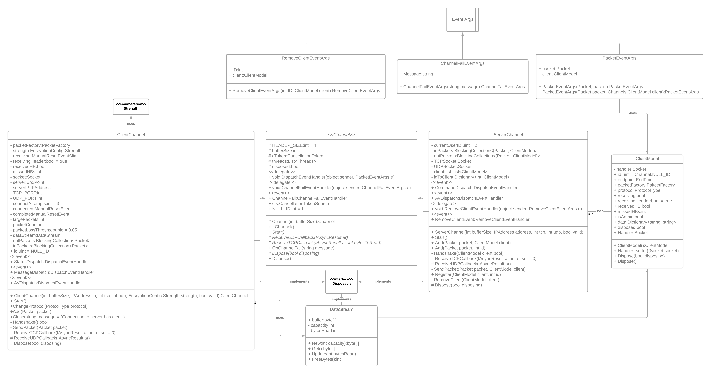
[*Raw view here*](https://raw.githubusercontent.com/lembn.github.io/master/docs/CLUNKS/README_img/common.channels.png)

The Common.Channels.Channel classes implement the C# `IDisposable` interface to allow its members (namely the sockets and encryption handlers) to be safely disposed by the Garbage Collector when they are no longer being used. This improves (decreases) the amount of memory used by the program and ensures that memory isn't being allocated or held for unnecessary objects. In the same fashion, throughout the program, variables are often reused for the same objective. The implementation of `IDiposable` also frees the IP address and port used by the socket when the channel is no longer in use so that they can be cleaned up by the OS.

`DataStream` is a class used to represent the stream of incoming bytes picked up by the listeners of a class. `ClientModel` is a class used by `ServerChannel` to represent a model of a connected client on the system. `ClientModel` derives from `DataStream` to represent the stream of incoming bytes being received by a specific client. Since `ClientChannel` is used on the client, it doesn't need to use a `ClientModel` (since `ClientModel` is used to model a remote `ClientChannel`) so uses `DataStream` directly.

### **Concurrency**

Both the client and server channels will use five 'master threads' to asynchronously perform operations. These five threads perform the network operations and can spawn other threads when needed to assist with their task.

One of these threads is the listening thread, used for listening for incoming data on the socket. The client only communicates with one server at a time, so the listening is quite simple but the server needs the ability to listen to multiple clients simultaneously. An adapted version of the Apache philosophy was implemented to achieve this.

Apache servers create a new thread to serve each incoming user's requests. Of course, this means that the limit to how many users can be served at once will be whatever the maximum thread count assigned to the program but on powerful machines with lots of system resources, this doesn't tend to be an issue. However, **CLUNKS** is designed to be friendly to all types of machine and on slower or systems, these limitations could ruin the user experience.

To combat this, the CLUNKS Server will create new threads only when needed to perform tasks, rather than to serve users. This means that instead of creating a new thread whenever a new user joins, a new thread will be created only if there are no idle threads available. For example, if there was only one listening thread currently being used, and a new user is attempting to send data, if the current thread is idle, that thread is assigned to process the new data. This minimises the number of threads being used by the program at any given time and also thwarts the Slow Loris DOS attacks that Apache servers are so vulnerable to since you can't force the server to reach its thread cap. *(Slow Loris attacks work by manipulating a server into creating new threads that are all serving the same machine so that no other machines can join)*

### **Packets**

Even though CLUNKS can use TCP/UDP for network transmission, alone, they only offer the ability to send bytes over the network, making it difficult for the receiving device to interpret what these bytes represent. To solve this a wrapper protocol will be needed to govern how these bytes should be arranged. This protocol will be implemented as a class: `Packet`, which provides an object that uses this protocol to arrange data for the `Common.Channel` classes to use when transferring data.

When data is being sent from one endpoint to another, a `Packet` will be created to hold the data. Packets contain some meta-data:
 - **DataID** - used to identify what type of information is held in the packet.
 - **UserID** - used to identify the user who created that packet (or the recipient user if the packet was created by the server).
 - **Salts** - used for certificates.

DataIDs will be implemented as a C# `enum`, to be used by the `Common.Channel` classes to identify how to handle different incoming packets.

UserIDs will be unsigned integers used by the server to identify different clients. Unsigned integers were chosen because negative numbers can cause encoding issues when serializing the `Packet` into a stream of bytes. Because of this, userID's are counted from 2 upwards, with the value 1 being the null value for an unassigned client. Normally, a negative number is used for a null value, for example: `-1`, however, as mentioned before, negative numbers cannot be used. The next value to consider is zero, but zero is also a bad value because `byte` objects have no null value. This means that when the `Pakcet` is serialized into an array of bytes and sent over the network, it becomes impossible for the receiver to distinguish between zero meaning the number `0` and zero meaning an empty byte. This ambiguity prevents `Packet`s from being accurately reconstructed.

*Client userIDs are not the same as database userIDs. The term 'Client' is used to refers to a CLUNKS client - a remote endpoint that has connected to a CLUNK Server. Client userIDs are numbers assigned to clients by the server to act as a unique identifier. The term 'User' refers to a database user - a CLUNKS client that has logged into a database account. Database userIDs are taken from the `id` field (primary key) of the database's `users` table and uniquely identify a user in the database.*

After the metadata, comes the `Packet` body. The 'body' of the `Packet` is a JSON object which holds the actual data to send. When `Packet`s are being sent, the metadata and body are added to a new JSON object called the `payload`. The payload of a `Packet` is a JSON representation of its full data. For example, the payload of a packet sending a cryptographic signature may look something like this:

```json
{
    "dataID": "Signature",
    "userID": 9,
    "salt": "]DAV,22K3[wDhLz",
    "body" : {
        "signautre": "&%%^rNsEZC3}1aX(gn2,:z"
    }
}
```
*NOTE: in reality, the salt and signautre are byte arrays encoded into Base64, so wouldn't contain some of the characters shown in the above example.*

When packets are being serialized, the payload is encoded into an array of bytes. This array of bytes is encrypted which is where the channels get their built-in encryption from. Since different parties at endpoints may be using different strengths of encryption and will be using different keys, etc, the only way to generalise the serialization and deserialization of `Packet` objects is for the algorithms which perform the operations to be separate from the cryptography information. This is achieved with the `PacketFactory` and `EncryptionConfig` classes. `PacketFactory` is a class that will be used to serialize and deserialize packets. `EncryptionConfig` is a class whose members will be used by `PacketFactory` instances to determine how a packet should be encrypted.

It allows different users to use different levels of encryption instead of forcing all users to use the same. This strongly follows the **CLUNKS** philosophy because cryptographic functions (encryption, decryption and hashing) can be very slow on less powerful machines. This is undesirable in a real-time conferencing scenario, where latency can be critical. Because of this, the server would have to choose between using stronger encryption that would increase security but worsen the user experience for users with less powerful machines, or use weaker encryption that would run will everywhere but be more vulnerable. `EncryptionConfig` solves this by allowing different users to choose how much encryption to use, and when, so that they can tailor their security to best suit them.
This achieves the abstraction of cryptography information from the serializers. Here is a UML class diagram showing `Packet`, `PacketFactory` and `EncryptionConfig` and how they are related:

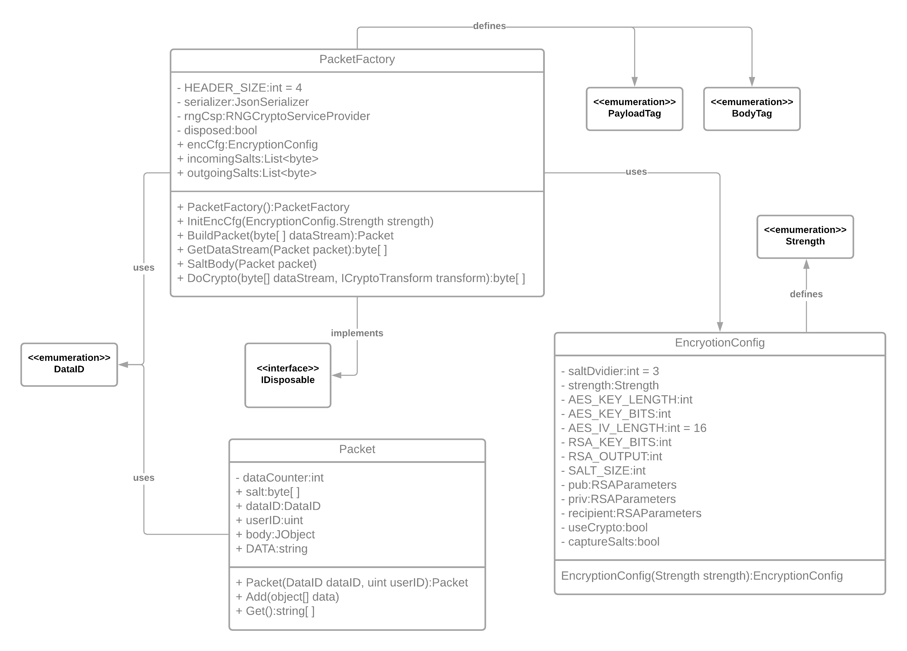
[*Raw view here*](https://raw.githubusercontent.com/lembn.github.io/master/docs/CLUNKS/README_img/common.packets.png)

---
<br>

The stream of bytes that `Packet`s get serialized into/deserialized out of is structured into three parts:

| Data | Length (in bytes) |
| ----------- | ----------- |
| Header | 4 |
| Crpytography Data | 256 |
| Payload | Value of Header |

A 4-byte header is used consistently across the program, following the conventional programming standard of 32-byte integers. The header is used by the receiver of a serialized packet to determine how many bytes of the incoming data stream makes up the payload of the packet. Because of this, the header must be a constant value so that the receiver knows how many bytes it should use to determine the header's value. Since the header represents a size it should never be negative, so could be implemented as a `uint` (unsigned integer) to maximise the range of the header by allocating all of its 32 bytes to positive values, however, theoretically, there should never be a packet whose serialized data stream is large enough to need the extended range, so it shouldn't matter.

After the header, comes the cryptography data. The table shows the length of cryptography data as 256 but in the program, it will be a value taken from an instance of `EncryptionConfig`. When serializing the packet, The byte-stream representation of the payload is symmetrically encrypted, then the key used to encrypt the payload is asymmetrically encrypted and stored in the *'cryptography data'* section of the byte stream. The reason that two cryptographic systems have to be used is because of the limitations of the RSA algorithm. In an ideal world, the payload would be encrypted with the recipient's public key and could be sent off from there, however, if the length of the payload byte stream is greater than the number of bits in the key, byte stream cannot be encrypted (because the RSA key can't cover the full extent of the data). This means that keeping the encryption purely asymmetric would require limiting the length of the byte stream to the length of the recipient's key (in bits) or hoping that the length of the data stream would no exceed the length of the recipients key. Both of these are far from ideal, so to solve the issue the data is encrypted symmetrically with AES-256. Since the AES key and IV are required for decrypting the data they must be sent along with it so is encrypted with the recipient's public key to secure it. This way the data is encrypted fully - with no limitations to its length, and securely - with no limitations to the cryptography. The symmetric keys used to encrypt the data are randomly generated per serialization. Asymmetric keys are maintained for the length of a client's session connected to the server.

Below are two flowcharts, to demonstrate operations performed by the serializers when building and breaking down `Packet`s:

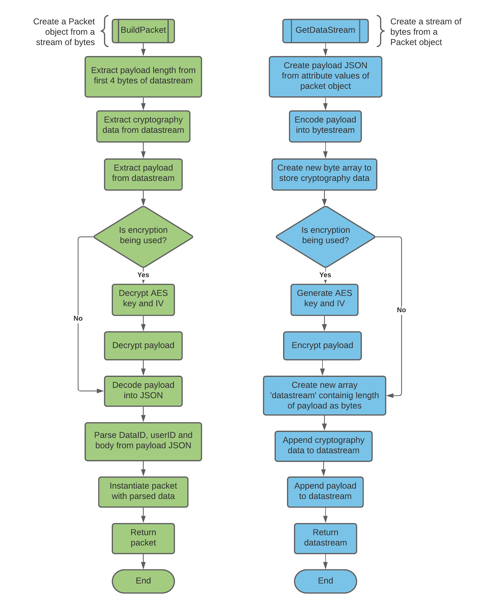
[*Raw view here*](https://raw.githubusercontent.com/lembn.github.io/master/docs/CLUNKS/README_img/serializers.png)

---
<br>

The `Common.Channels.Channel` classes will define a method called `Handshake`. `Handshake` will be used to perform the cryptography key exchange and compare asymmetric signatures. The handshake starts with the client sending a 'Hello' message to the server. This message contains the strength of encryption being used by the client, the server responds with an 'Ack' (acknowledgement). Moving on to the second stage, an 'Info' message from the client containing the client's public key is sent to the server. The server responds to this with a 'Hello' message containing its public key. For the third roundtrip, an 'Ack' message is sent from the client, responded to with an 'Info' message from the server containing the userID that the server has chosen to assign the client. This is responded to with the clients digital signature.

The digital signatures are created with a combination of encryption and hashing. Before the signature exchange, all messages have a *salt* added to them. Salts are randomly generated values that are appended to the body of a data payload to use for digital signature creation. The idea behind this is that at the end of the handshake, both parties need some data to sign to use for the encryption, usually, this would be a log of all messages sent between the client and server (since it would be common to both) but in this case, since the stages of the handshake are always the same, the data used to create the certificate would always be the same too. To solve this, the salts are captured and stored by both parties and used to create the certificated at the end of the handshake. This adds a random element to the source for the signature so that it can't be easily replicated.

To create a certificate:
 1. The creator first hashes the list of all the salts they have sent out to create the certificate
 2. The hash is then signed (encrypted) with the creators PRIVATE key (very important to note that the private key is being used for encryption instead of the public one)
 3. The signed certificate can then be sent off to and verified by the other party

To verify a certificate:
 1. The verifier decrypts the certificate they have been sent using the sender's PUBLIC key
 2. They then hash the list of all the salts they have received (using the same hash functions as the creator) to create their version of the same certificate
 3. The two certificates can then be compared and if they match then the signature is verified

This process is done once from server to client, then from client to server to provide security, integrity and confidentiality on both ends. It provides:
 - Security via the encryption
 - Integrity via the hash (because if the data was changed the hashes wouldn't match)
 - Confidentially via the signing of the asymmetric keys (since the intended sender would be the only person who had the correct private key to be able to sign the original digest).

## Class Design - Program.cs

Both the Client and Server projects will contain a file called `Program.cs` which will define `Program`, the class acting as the entry point for the respective programs. Client's `Program` will contain the main Client program code while Server's `Program` will define the necessary prerequisites needed for the server to run as a hosted service on the system and inject them into `Server.Worker`, which is where the main program code for the Server will be.

## Class Design - Programmatic Database Interaction

To interact with the database, the server will use a library of methods that will abstract from the low-level operations used for database manipulation. These methods will be organised into a static class `DBHandler`, a part of the Server's `DBHandler` namespace. This will simplify the Server programming as it will only need to call into `DBHandler.DBHandler`'s methods to get manipulate the database, without needed to worry about the logic behind the operations. It will also keep the code DRY (**D**on't **R**epeat **Y**ourself) since repeated database code will be eliminated. For `DBHandler` to achieve this, another class will be needed to provide some more abstraction. `Microsoft.Data.Sqlite` (the library containing the database interaction classes/methods) does not provide a cursor class, and instead provides the `SqliteConnection`, `SqliteCommand` and `SqliteDataReader`. Objects are supposed to be instantiated from these classes and used together to connect to, manipulate and read data from the database respectively. Since `DBHandler.DBHandler` has to be made to be thread-safe to accommodate for the multi-threaded server, it can't simply use a single instance of each of these classes across the class as that could cause issues with race conditions or force threads to wait for each other. This means that each method of `DBHandler.DBHandler` would need its own `SqliteConnection`, `SqliteCommand` and `SqliteDataReader` and with the large number of methods contained within `DBHandler.DBHandler`, repeatedly instantiating objects out of these classes would not only by *un*-DRY but would also increase the memory and CPU footprint used by the class.

To solve this issue, another class will be added to the `DBHandler` namespace: `Cursor`. `Cursor` will contain object of the `SqliteConnection`, `SqliteCommand` and `SqliteDataReader` classes and abstract them from  `DBHandler.DBHandler`, exposing only one method, `Execute` compared to the previous three execution methods on `SqliteCommand`: `ExecuteNonQuery`, `ExecuteScalar`, `ExecuteReader`. This simplifies the usage of a `Cursor` object compared to a `SqliteCommand` and will simplify the `DBHandler.DBHandler` methods heavily. The reason that `SqliteCommand` exposes three methods for execution is for the three types of execution statements: Scalar Queries, Non-Scalar Queries and Non-Query statements. Scalar queries are statements that contain queries that will return one-dimensional values, for example:

```sql
SELECT id FROM users WHERE name='Mike';
SELECT id FROM users;
```

In the first statement, only one value is returned (assuming 'Mike' is a unique name), in the second statement, a single-dimensional array of `id`s is returned. Non-scalar queries are queries that return values with multiple dimensions, for example:

```sql
SELECT id, name FROM users;
```

Here, a 2-D array will be returned containing the `id`s and `name`s of all the users in `users`. Finally, an example of a non-query statement is:

```sql
UPDATE users SET name='Mark';
```

In this example, nothing is returned from the statement, since nothing was requested. `Cursor.Execute` aims to emulate the behaviour of all three of `SqliteCommand`'s execution methods and combine them into one method. Then the result of the call (if it exists) can then be casted into the appropriate type by the caller. Here is a pseudocode algorithm showing how `Cursor.Execute` should work:

```
FUNCTION Execute(statement, parameters)
    toReplace = Regex.Matches(statement, "(\$)(\w)*")
    command.CommandText = Regex.Replace(statement, @"\t|\n|\r|", "")
    command.CommandText.Trim()
    command.Parameters.Clear()
    FOR i = 0 TO toReplace.Length - 1
        command.Parameters.AddWithValue(toReplace[i], parameters[i])
    ENDFOR
    operator = command.CommandText.Split()[0].ToLower()
    IF (operator == "select" || (operator == "pragma" && !command.CommandText.Contains('='))) THEN
        results = []
        reader = command.ExecuteReader()
        WHILE (reader.Read())
            results.Add(reader.GetValues());
        ENDWHILE
        reader.Close()
        IF (results.Count == 1) THEN
            IF (results[0].Length == 1) THEN
                RETURN results[0][0]
            ELSE
                RETURN results[0]
            ENDIF
        ELSE
            firstItems = []
            FOR i = 0 TO results.Length - 1
                IF (results[i].Length > 1)
                    RETURN results.ToArray()
                ELSE
                    firstItems.Add(results[i][0])
                ENDIF
            ENDFOR
            RETURN firstItems
        ENDIF
    ELSE
        command.ExecuteNonQueryAsync()
        RETURN NULL
    ENDIF
ENDFUNCTION
```

First, any parameters contained within `statement` are extracted with the regular expression `(\$)(\w)*`. Parameters are denoted with a `$` within the statement so any word preceded by a dollar sign should be extracted by the regular expression and stored in `toReplace`. After this `statement` is cleaned of whitespace and assigned to the `CommandText` property of `command` (the `SqliteCommand` used to hold information about the current command). Parameters are then bound to their 'in-statement representation and after this, the algorithm will check to see if the `statement` was a query statement or not. Since the only SQL commands that could return a value are `SELECT` and `PRAGMA`, if the operator in `statement` was not one of these, it can execute `command` with `ExecuteNonQueryAsync()` and return null, since `command` didn't represent a query.

If `command` does represent a query, the results of the query are read from the `SqliteReader` and stored in results. If there was only one row read then the result is either a single value so can be returned independently, or a single row/array of values and can be returned as such. If multiple rows were read the algorithm will first check to see if each row only returned one value, if so the returned array should be one-dimensional, otherwise the whole `results` array can be returned. `DBHandler.Cursor` will also implement `IDisposable` so that the `SqliteConnection` object can be cleaned up when the `Cursor` object is disposed of.

## Complex Data Processing - Entity Tracing

'Entity traces' are used throughout the CLUNKS client and server sides to both display and determine the location of a user in the server's overall structure. An example of an entity trace is `subserver1 - room1 - room2`. This trace would be referred to as the trace for the room '`room2`', which is a child of the room '`room1`', which is a child of the subserver '`subserver1`'. Traces are created in the program in two ways:
- In the client where the trace of the user's location is built up as they traverse to different entities
- In the server's `DBHandler.DBHandler.Trace` method which finds the trace of an entity using only the name of the lowest child of the path (this would be `room2` in the previous example.)

This segment will be focusing on the logic behind `DBHandeler.DBHandler.Trace`, a function to calculate the trace of a given entity. The psuedocoded function is shown below:

*`entityTables = ["subservers", "rooms", "groups"]`* <br>
*`_entityTables = ["subserver", "room", "group"]`* <br>

```
FUNCTION Trace(trace, cursor)
    IF cursor.Execute("SELECT COUNT(*) FROM subservers WHERE name=trace[0];") > 0 THEN
        cursor.Dispose()
        RETURN trace
    ENDIF
    index = 1
    IF cursor.Execute("SELECT COUNT(*) FROM groups WHERE name=trace[0];") > 0
        index = 2
    ENDIF
    id = cursor.Execute("SELECT id FROM entityTables[index] WHERE name=trace[0];")
    parentID = cursor.Execute("SELECT parent FROM _entityTables[index]_entityTables[index] WHERE child=id;")
    IF parentID = NULL THEN
        parentID = cursor.Execute("SELECT _entityTables[index - 1]ID FROM _entityTables[index - 1]_entityTables[index] WHERE _entityTables[index]ID=id;")
    ENDIF
    trace = trace.Push(cursor.Execute("SELECT name FROM entityTables[index] WHERE id=parentID;"))
    RETURN Trace(trace, cursor)
ENDFUNCTION
```

*Where `cursor` is an instance of `DBHandler.DBHandler.Cursor` and `trace` is an indexable stack of strings representing the current trace with the first item of the list representing the first item of the trace. If index `a` is already occupied,  The explaination below will use the `subserver1 - room1 - room2` trace as an example.*

`Trace` utilises a recursive algorithm to create the trace of an entity. In this fashion, the first thing checked by the algorithm is the base case. Since traces are built from the lowest child (a room or group) up to a subserver, the bottom (leftmost) item of the trace represents the highest-ranking entity found so far. When the algorithm is complete, this 'bottom' value is the name of some subserver, so the base case for this recursion is if the bottom value of the trace is present in the `subservers` table of the database. This algorithm checks the presence of an entity in the database by counting the number of entities with the specified name. If the returned value (for the base case) is greater than zero, then the bottom value indicates a subserver and the trace can be completed, so the cursor can be disposed so opened caches or WAL data is closed/cleaned up and the trace is returned.

Otherwise, the algorithm checks to see if the bottom entity is a room or a group. After identifying this the parent can be found and added to the trace. This is done by first finding out the parent's ID in the database from the appropriate linking table, then querying the name using the ID as a search index. When the current bottom entity is a room or group, the parent entity can either be of the same type (another room/group) or of the next type up in the hierarchy (group -> room or room -> subserver). To identify this the presence of the parent is first tested in the `room_rooms`/`group_groups` tables appropriately. If this test fails, the result stored into `parentID` will be null, so the parent must belong to the upper ranking table (`subserver_rooms`/`room_groups`) and the parent's ID is found from there.

Once the parent's ID in the database has been found, the parent's name can be found and added to the trace, then `Trace` method will call itself with the new name in the bottom entry.

## Class Design - Message Feed

The Client program will need to use some class to handle incoming messages from the server. While this may seem like a simple task, it can actually be quite complicated to manage because messages can come in at any time. Server responses are expected from the server whenever a client makes a request. Because of this, the Client program easily can control the way that these are presented on the console without interrupting the current actions of the user. Messages, on the other hand, are completely unpredictable. They can come in at any time so can't be simply outputted to the console since they may end up interrupting the user. The next best thing may seem to be to wait for a good time to alert the user of the message, and then either show it to them or prompt them to look for the message, however, this can make the process tedious for the user and also takes the user out of the real-time experience that **CLUNKS** aims to offer.

This is why the design for an asynchronous message feed was chosen. The user can bring up a feed by running the `feed` command and from there can see all their messages. The class that manages this is the `Client.Helpers.Feed` class and because it's asynchronous, it can update itself while the user continues to use **CLUNKS** as they please.

When new messages need to be added to the feed, they will be added with this method (psuedocoded):

```
PROCEDURE Add(username, message, entity)
    text = []
    colours = []

    PROCEDURE Add(textToAdd, colourToAdd)
        text.Add(textToAdd)
        colours.Add(colourToAdd)
    ENDPROCEDURE

    isGlobal = NOT entity.IsEmpty()
    IF username == YOU THEN
        Add("YOU", ConsoleColor.Blue)
    ELSE
        Add(username, ConsoleColor.Blue)
    ENDIF
    IF isGlobal == TRUE THEN
        Add("@", ConsoleColor.Gray)
        Add(entity, ConsoleColor.DarkGreen)
    ENDIF
    Add(" - ", ConsoleColor.Gray)
    Add(message, ConsoleColor.Gray)
    IF pointer > 0 && updated THEN
        PrintHeader("[INCOMING FEED - (▼)]")
        updated = FALSE
        pointer = pointer + 1
    ENDIF
    linesAdded = 1
    counter = 0
    insertList = []
    IF isAlive == TRUE THEN
        insertList = lines
    ENDIF
    insertList.Insert(0, []);
    FOR i = 0 TO text.Count - 1
        IF counter + text[i].Length > width THEN
            overflow = counter + text[i].Length - width
            insertList[0].Add([text[i].Substring(0, text[i].Length - overflow), colours[i]])
            insertList.Insert(0, [])
            pointer = pointer + 1
            linesAdded = linesAdded + 1
            counter = 0
            text.Insert(i + 1, text[i].Substring(text[i].Length - overflow, overflow))
            colours.Insert(i + 1, colours[i])
        ELSE
            insertList[0].Add([text[i], colours[i]])
            counter = counter + text[i].Length
        ENDIF
    ENDFOR
    IF isAlive == FALSE THEN
        Save(insertList);
    ELSE
        IF updated == TRUE THEN
        Update((Console.CursorLeft, Console.CursorTop));
        ENDIF
    ENDIF
ENDPROCEDURE
```

First, the procedure will take the message data and sort and store it into `text` and `colours` such that the text stored in *`text[n]`* should be coloured with the colour stored in *`colours[n]`*. After this the value of `pointer` is checked to see if it is greater than zero. `pointer` is an integer variable used in the `Feed` class to point the element of `Feed.lines` that should be outputted onto the bottom line of the feed. `lines` is a 3-dimensional list of feed line data that stores information about the lines in the feed such that if each line in `lines` was outputted, it would display the whole contents of the feed *(this is never done in the program, merely for demonstration.)*. A good visualisation of `lines` is:

>
>*`[`* <br>
>&nbsp;&nbsp;&nbsp;&nbsp;*`[["fred", "red"], [" - ", "gray"], ["hey mark, its fred here!", "gray"]],`* <br>
>&nbsp;&nbsp;&nbsp;&nbsp;*`[["mark", "blue"], [" - ", "gray"], ["hey fred, how you been?", "gray"]],`* <br>
>&nbsp;&nbsp;&nbsp;&nbsp;*`[["fred", "red"], [" - ", "gray"], ["good thanks, how about you?", "gray"]],`* <br>
>&nbsp;&nbsp;&nbsp;&nbsp;*`[["mark", "blue"], [" - ", "gray"], ["all good over here too.", "gray"]],`* <br>
>*`]`* <br>

The purpose of `pointer` is for the feed to keep track of the user's position in lines. New lines are always inserted into the `0th` element of the feed such that the bottom of the feed shows the new messaged. `pointer` is checked to see to be greater than zero because that the user has scrolled away from the newest message, and it isn't visible in the feed. Since `Add` is only called when new messages come in, `pointer` being away from zero at this point means that the feed is now out of date, so the header is updated to display `"[INCOMING FEED - (▼)]"` to alert the user that there are new messages to view. The boolean variable `updated` is then set to `false` to represent that the feed is out of date and `pointer` is incremented to accurately point to the line that is displayed at the bottom of the feed. When `pointer` is checked to be greater than zero, `updated` must also be true for the condition to be satisfied. Setting updated to `false` prevents the condition from being satisfied again if `Add` is called before the user scrolls down to the bottom of the feed.

`linesAdded` is an integer used to count the number of lines that `Add` has added to `lines`. It is initialised to `1` because any message must take up at least one line. `counter` is an integer used to count the number of characters that the current line has used, to see if a new `line` needs to be created. `insertList` is a reference the list that new lines should be inserted into. `isAlive` represents if the current feed is active or not so if the `isAlive` is true, new lines should be inserted into `lines` so that they can be outputted by `Update`, otherwise the lines should be added to a new list so they can be saved to the message file and loaded when a new feed is activated.

A new element of `insertList` is created. This element represents the first line that will be added. After this, the procedure will iterate through `text` to continually add all the `text` from the message until it has added everything. Inside this loop, the algorithm checks to see if the current text to add will fit in the current line or go over. This is done by comparing `counter + text[i].Length` to `width`, where `width` is an integer storing the `width` of the console calculated elsewhere in the class. If it will fit then it is added to the current line element, and `counter` is increased to accurately represent the number of characters used up by the current line. If the current text won't fit, then the program will calculate how many characters of the current text will overflow the current line. This value is then stored into `overflow`. The algorithm will then fill the current line with as much of the current text that can fit (with `text[i].Substring(0, text[i].Length - overflow)`), then create a new line element. Since the algorithm is now on a new line, `pointer` and `linesAdded` are and `counter` is reset. The algorithm then inserts the remaining text from the current text back into the `text` list, so that on the next iteration, the overflow characters will be processed accordingly.

When this loop ends the program will either update the feed to display the new line (if the user isn't scrolled) or save the new lines into the message file. The message file is used to store line data while the feed is deactivated. This allows `lines` to be cleared and remain empty until the feed is recalled since `lines` isn't currently being used, reducing the memory footprint of the program.

When initially designing `Feed`, many options for `lines` were considered, one of the most (seemingly) promising ones was to utilise a circular stack to buffer incoming messages. Originally, messages were going to retain their structure, being stored in an object called `FeedLine` that would store its version of `lines` specific to whatever message it represents. `Feed` would then use a circular stack to hold the objects in a buffer, holding a fixed amount and allowing older messages to get discarded. This not only created a good structure for discarding old messages but was very efficient on memory since instead of growing the stack (as `lines` currently does), its spaces were recycled and used to store newer messages.

For example for a feed of maximum length 5, a circular stack of length 5 could be created. Each time a new message comes in it would be built into a `FeedLine` object and added to the rear of the stack. If another object was already in this position, it was an old message that could be overwritten. Then when the user wanted to display the line data, `FeedLine`s would be read from the rear of the stack (since thats where the newest messages were) and outputted to the console. This seemed like a great idea at the time, even though there would be some pretty complex logic involved with getting the correct lines out of the `FeedLine` object (especially when the user scrolled or if `FeedLine`s contained multiple lines within them), the efficiency of the design was incredible. 

Unfortunately, further brainstorming identified that while this works in theory, the design is flawed because if the user was scrolled up while new messages came in, the new messages could potentially overwrite the chat history even up to the message that the user was viewing, so the continuity was lost. Solving this would mean either disabling the scroll or looking for a new design, and since the scroll was such a valuable part of the feed, a new design was sought after, bringing feed to uses the `lines` list it is designed for now.

### **State**

`Feed` needs a variable (`isAlive`) to keep track of if the feed is active or if it has been automatically deactivated. Normally this could be implemented a standard C# boolean, but booleans are `struct`s which are *'value type'* objects. This means that they store the actual data they are supposed to represent. In comparison, a *'reference type'* object like `class` stores references to the memory location where the data is stored, instead of storing the actual data itself. The problem this introduces is that `isAlive` needs to be locked in some places of the class, to make sure that threads don't edit its value while other threads are reading it. This is a problem because value type objects can not be used with C#'s `lock` statement, only reference types. The solution was to create a wrapper, `State` to wrap the standard C# boolean in a class so that it can be used as a reference type object. After this, the wrapper must define the `implicit` and `explicit` cast operators. These operators tell the compiler how to cast a `State` object into a boolean so that `State` objects could be used like normal booleans for comparisons and assignments. `State` can be found in the `Client.Helpers` namespace.

--------
<br>

## ClunksEXP

ClunksEXP, developed in python, is a GUI program the wraps around its main functionality script `IOManager.py`. The module `IOManager` contains a class `IOManager` which contains the methods that perform the bulk of the heavy lifting in terms of data processing. `.exp` files will be loaded and created by instances of `IOManager.IOManager` and ClunksEXP's file storage is managed there too. Like `Client.Helpers.Feed`, ClunkEXP will utilise a temporary file (this time created by the system in the user's temp folder) to store data until it is either exported out to an `.exp` or the program is closed. The data stored in this file are python `list`s serialized with `pickle`. The `list`s are created by the program to represent that data that sources the `.exp` and should look something like:

>
>*`[["ss1"]]`* //*sub-server data*<br>
>*`[],`* //*room data*<br>
>*`[["u1", "", "user", "True"], ["u3", "", "user", "True"]],`* //*user data*<br>
>*`["user_elv", "True", "True", "True", "True", "True", "True", "True", "True", "True", "user"],`* //*elevation data*<br>

Which would generate the corresponding `.exp`:
```xml
<?xml version="1.0"?>
<root>
  <subservers>
    <subserver name="ss1"/>
  </subservers>
  <globalUsers>
    <user username="u1" password="" sectors="user" global="True" elevation="user_elv"/>
    <user username="u2" password="" sectors="user" global="True" elevation="user_elv"/>
  </globalUsers>
  <elevations>
    <elevation name="user_elv" privilege="511" sectors="user"/>
  </elevations>
</root>
```

ClunksEXP uses sectors to create logical groupings of users within the program. A sector represents a group of users. In the above example, *`user_elv`* elevation has been created with the sector *`"user"`*. This information is used by the exporter to determine that any user with the *`"user"`* sector applied to them, should have the elevation privileges denoted by `user_elv`

ClunksEXP's GUI will be managed by `ClunksEXP.Windows.MainWindow`, the module loaded by the entry point script for the program. This will create the main window and any other new windows of the program. `MainWindow` will also host threads, created when a new window is created, to make sure that windows can't be duplicated. These windows will be instances of classes that will represent the window programmatically. Each of these classes will derive from a base class `Editor` which will define the overall behaviour that any editor should have, helping to keep the subclasses DRY.

## UI Design
Other than `Feed`, the Client UI is very simple since it is all contained within a standard console. The aim is for the UI to be informative to the user while still retaining simplicity. Here is a sample of how the UI should look on startup of the Client:

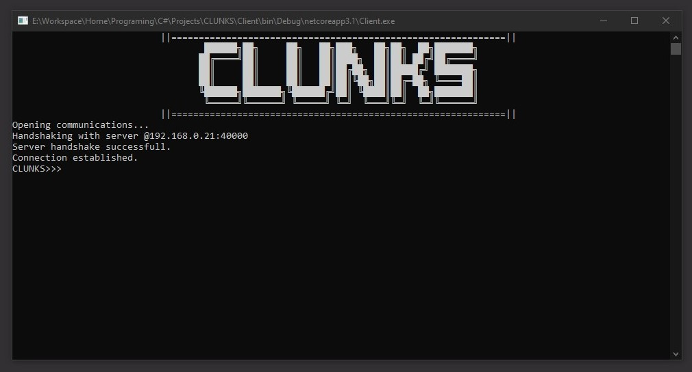

Since the server is designed to be a long-running service, it has no UI and won't be assigned one by the system. When debugging, an editor like Visual Studio may provide a console that can be used as a sink for logging from the executable but when the code is built into the target service, it will run with no UI.

On the other hand, ClunksEXP will have the most advanced UI of all the parts of **CLUNKS**. This will entail multi-window browsing that should looks something like this:


# **CLUNKS** - A Guided Tour
*NOTE:*
> *For viewing and executing the code, it is recommended to clone the entire repository and load the `CLUNKS.sln` file into Visual Studio so that the appropriate files can be loaded to carry through required dependencies and code arrangments. This will load the Client, Server and Common projects which can then be executed using the debug tools within Visual Studio. From here, the Client and Server projects both need to be set to 'Start' in the 'Multiple Startup Projects' menu. To run outside of Visual Studio, the Client and Server executables need to be built and can then be run from the debug binaries. It is recommended to run the Server as a debug executable instead of building it into its target service. When running the Client within Visual Studio, the command line arguments, specifying the socket data to connect to the server need to be supplied in the project properties. For viewing the ClunksEXP code, it is recommended to open the `ClunksEXP` folder of the repository in a python-supporting IDE*.

Now that the programming is complete, a tour of the project can show the most computationally interesting parts of the different components that make up the solution. **CLUNKS** contains many different complexities within its programmed solution (some of which will not be covered because this section would go on forever) but this section will look through the 4 main stages of the program:
- Creating a `.exp` file to construct the configuration of the server
- Importing a `.exp` file configure the server
- Providing communication between two endpoints connected on a netork
- Connecting to a **CLUNKS** Server as a **CLUNKS** Client

The best place to start is with a look into ClunksEXP, the program used to create the `.exp` file needed to intialise a server. For reference, this is how it looks to create a new `.exp` file from scratch:

## Creating an EXP


This is the contents of the `.exp` file generated by the export shown above:

```xml
<root>
	<subservers>
		<subserver name="ss1" sectors="user,user">
			<room name="room1" password="" sectors="user,user">
				<room name="room2" password="$2b$12$k7374XRZMQ9XNxIdnpfPlOY5Qo6sCbEU9IiVE1EKBdGidQ6wGWjdi" sectors="user,user">
					<user username="user1" password="$2b$12$S4DBRQAeSo98PvXasjkXKeTt/84.brToW6HIjUXJgtMHeVdNvOfEe" sectors="user" global="False" elevation="user_elv" />
					<user username="user2" password="$2b$12$pKER5dN4bY3OVMFZDU6VQu/GpeukpBXu81UFPAGmKwP7folQ3otri" sectors="user" global="False" elevation="user_elv" />
				</room>
			</room>
		</subserver>
	</subservers>
	<elevations>
		<elevation name="user_elv" privilege="510" sectors="user" />
		<elevation name="admin_elv" privilege="511" sectors="admin" />
	</elevations>
	<globalUsers>
		<user username="admin" password="$2b$12$4s.1LPPv1nb3zaElJtirIeNHI7PfWelEEVrD8d7iqgQQ0NwQDIesC" sectors="admin" global="True" elevation="admin_elv" />
	</globalUsers>
</root>
```

For a look into how the GUI classes are handled, please view the code in [*this module*](ClunksEXP/gui/windows/MainWindow.py). An interesting thing to look out for here are multi-threading techniques used to handle the opening, closing and lifting of windows and the global `QUIT` event used to clean up all the threads and resources and close the program *(It's essentially a manual version of C#'s CancellationToken implemented into python)*. `ClunksEXP/gui/windows/CustomWidgets.Editor` (the base class for the editor windows) has some nice logic as well. This section will be focusing on `IOManager.IOManager.Export`. As mentioned in the design, the `IOManager` module carries the data processing of the program and a good example of this is `Export()`. The method is quite long (around 200 lines) so to view the full method it please navigate [*here*](ClunksEXP/IOManager.py) otherwise, parts of the method will be broken down and explained below.

The first couple blocks of the method set up some of the variables and objects that will be used later on in the algorithm. One thing to note is that the variable `entities` is reused throughout the program to store data loaded from the temporary file. This helps to save memory since after one batch of data has been processed it doesn't need to be reused so can be overwritten. This also prevents large amounts of memory from being allocated from the heap in the case that each other sets of loaded data is large.

At this point:

```python
for x in range(len(entities)):
    name = entities[x][0].lower().strip()
    if name not in subserverNames:
        subserverNames.append(name)
    else:
        logFunc('EXPORT FAILED: Subserver names must be unique.')
        return
    subserverElements.append(ET.SubElement(subserverRoot, 'subserver', {'name': entities[x][0]}))
    nameToSubserver[entities[x][0]] = x
    if not entities[x][1].split(',')[0]:
        noSectorSubservers[x] = None
    else:
        for sector in entities[x][1].split(','):
            if sector:
                try:
                    sectorToSubserver[sector.strip()].append(x)
                except KeyError:
                    sectorToSubserver[sector.strip()] = [x]
```

The algorithm starts to create nodes in the `.exp` document to represent the subservers. This is done in the first `if` statement block. The second `if` statement block (`if not entities[x][1].split(',')[0]`) is used to track subservers that weren't assigned a sector by the user. In this case, the sectors of the subserver should be derived from the sectors of the users who exist on that subserver. In the worst-case scenario, a subserver could have no sectors, and no direct users exist on it. This subserver could then contain a room that also had no sectors, which may contain more rooms with no sectors on them. In this case, to find the sectors for the subserver, the program would have to trace upwards from the user on the lowest child of the subserver tree, back up to the subserver to apply the sectors. Clearly this has the potential to be a very complicated problem, but this is performed later on in the program. *Even though sectors are completely ignored by the Server when loading `.exp`s into the database, they are used by ClunksEXP when importing existing `.exp`s files to be edited. This is why they need to be accurately preserved*

For now, if a subserver has no sectors, a new entry is added into `noSectorSubserver` pointing from the index of the current subserver in the list of subservers (`subserverElements`) to `None`. If a subserver does have sectors applied to it then for all the sectors on the subserver, `sectorToSubserver` is edited such that the entry containing the concerned sector points to a list that contains the index of the current subserver in the list of subservers. By the end of the code block above (If there were no failures):
- `subserverElements` is a list containing XML element objects representing all the processed subservers
- `subserverNames` is a list of all the subserver names
- `nameToSubserver` is a dictionary that points from the name of a subserver to the index of that subserver in `subserverList`
- `noSectorSubservers` is a dictionary pointing from the index of a subserver to `None`
- `sectorToSubserver` is a dictionary pointing from a sector name to a list of indexes of subservers who have that sector

Next, the room data is processed:

```python
for x in range(len(entities)):
    name = entities[x][0].lower().strip()
    if name not in roomNames and name not in subserverNames:
        roomNames.append(name)
    else:
        logFunc('EXPORT FAILED: Room/subserver names must be unique.')
        return
    if entities[x][2] in subserverNames:
        room = entities[x]
        processedRooms.append(x)
        roomElements.append(ET.SubElement(subserverElements[nameToSubserver[room[2]]], 'room', {'name': room[0], 'password': room[1]}))
        nameToRoom[room[0]] = len(roomElements) - 1
        parentIndex = nameToSubserver[room[2]]
        if not room[3].split(',')[0]:
            if parentIndex in noSectorSubservers.keys():
                noSectorSubservers[parentIndex] = len(roomElements) - 1
            noSectorRooms[len(roomElements) - 1] = None
        else:
            for sector in room[3].split(','):
                if sector:
                    if parentIndex in noSectorSubservers.keys():
                        try:
                            sectorToSubserver[sector.strip()].append(len(subserverElements) - 1)
                        except KeyError:
                            sectorToSubserver[sector.strip()] = [len(subserverElements) - 1]
                        del noSectorSubservers[parentIndex]
                    try:
                        sectorToRoom[sector.strip()].append(len(roomElements) - 1)
                    except KeyError:
                        sectorToRoom[sector.strip()] = [len(roomElements) - 1]
    elif entities[x][2] not in roomNames:
        logFunc(f"EXPORT FAILED: Parent of room '{entities[x][0]}' does not exist.")
        return
```

This iteration is responsible for processing rooms that are children of subservers. This is represented in the code with the `if entities[x][2] in subserverNames` condition. If this condition isn't satisfied, `elif entities[x][2] not in roomNames:` is tested to see if the parent of the room actually exists in the data. If it doesn't the user is alerted and the export is failed. Otherwise, the program keeps track of the fact that it is processing the current room, by storing the index of the room (`processedRooms.append(x)`). This is so that in the next loop, processed rooms aren't re-processed. After creating a new XML element object to represent the current room and appending it to `roomElements`, the name of the room is also noted in the `nameToRoom` dictionary.

The room's sectors are then checked. If the room has no sectors, the algorithm checks to find if the parent also has no sectors. In this case, the `None` value pointed to by the index of the parent is replaced by the index of the current room. This is used for tracing sectors back to the subserver when one is finally found for the room. If the room has sectors then for each sector applied to the room the algorithm will manipulate `sectorToRoom` in the same way that `sectorToSubserver` is manipulated in the previous loop. If the room has sectors and the parent is found to have no sectors, then the sectors are applied to the subserver by updating `sectorToSubserver`. By the end of the code block above (If there were no failures):
- `roomElements` is a list containing XML element objects representing all the processed rooms
- `roomNames` is a list of all the room names
- `nameToRoom` is a dictionary that points from the name of a room to the index of that room in `roomList`
- `noSectorRooms` is a dictionary pointing from the index of a room to `None`
- `sectorToRoom` is a dictionary pointing from a sector name to a list of indexes of rooms that have that sector
- `noSectorSubservers` has been updated to contain the indexes of subservers that originally had no sectors but now have sectors applied to them

After this, another iteration is performed through the same list to process the rooms left unprocessed by the previous loop. While it may seem inefficient to iterate twice over the same list, the operations performed by the second iteration rely on the data collected by the first one. Because of this combining the two iterations into one loop would require the second loop to be run each time the first loop comes round so that it can update its data. This would have a polynomial time complexity of O(n^2), which is worse than the current complexity of O(2n) -> O(n). Here is the code for the second loop:

```python
for x in range(len(entities)):
    if x not in processedRooms:
        room = entities[x]
        parent = roomElements[nameToRoom[entities[x][2]]]
        roomElements.append(ET.SubElement(parent, 'room', {'name': entities[x][0], 'password': entities[x][1]}))
        nameToRoom[room[0]] = len(roomElements) - 1
        parentIndex = nameToRoom[room[2]]
        if not room[3].split(',')[0]:
            if parentIndex in noSectorRooms.keys():
                noSectorRooms[parentIndex] = len(roomElements) - 1
            noSectorRooms[len(roomElements) - 1] = None
        else:
            if parentIndex in noSectorRooms.keys():
                if isinstance(room[3], list):
                    ApplySectorsRecrusive(parentIndex, room[3])
                else:
                    ApplySectorsRecrusive(parentIndex, [room[3]])
            for sector in entities[x][3].split(','):
                if sector:
                    try:
                        sectorToRoom[sector.strip()].append(len(roomElements) - 1)
                    except KeyError:
                        sectorToRoom[sector.strip()] = [len(roomElements) - 1]
```

Here, the previously unprocessed names are processed normally in terms of creation, being added to `nameToRoom` and being added to `noSectorRooms` if the room has no sectors. The difference here is what happens when a room does sectors. In the previous loop, all the rooms being handled were children of a subserver. This means that if a room had sectors and its parent subserver didn't it was easy to apply these sectors onto the server since a subserver is always at the root of a tree of entities. In this loop though, the parent is a room. This room's parent could also be a room and that rooms parent could also be a room. In theory, this relationship could go on forever before reaching the subserver as is the design of how rooms are meant to be created (because theoretically, rooms can be infinitely created within each other). While this isn't a problem and was a deliberate choice in the design, it introduces a problem of tracing the sectors back up to each element that should have them.

To solve this issue, the recursive function `ApplySectorsRecrusive` (which is local to the scope of `Export`) is called to trace entities back up to the server, and apply the appropriate sectors along the way. This function can be thought of as similar to `Server.DBHandler.DBHandler.Trace` but doesn't have the liberty of searching a database to find the parents of the current entity and instead has to utilise reverse dictionary lookup traversal to locate the next entity to process. Here is `ApplySectorsRecrusive` in full:

```python
def ApplySectorsRecrusive(index, sectors, searchSubservers = False):
    if searchSubservers:
        for sector in sectors:
            if sector:
                try:
                    sectorToSubserver[sector.strip()].append(index)
                except KeyError:
                    sectorToSubserver[sector.strip()] = [index]
        del noSectorSubservers[index]
    else:
        for sector in sectors:
            if sector:
                try:
                    sectorToRoom[sector.strip()].append(index)
                except KeyError:
                    sectorToRoom[sector.strip()] = [index]
        del noSectorRooms[index]
        found = False
        for parent, child in noSectorRooms.items():
            if child == index:
                ApplySectorsRecrusive(parent, sectors)
                found = True
                break
        if not found:
            for parent, child in noSectorSubservers.items():
                if child == index:
                    ApplySectorsRecrusive(parent, sectors, True)
                    break
```

Similar to `Server.DBHandler.DBHandler.Trace`, `ApplySectorsRecrusive` checks to see if it has reached the subserver first, as this is the base case for the recursion. If the recursion has reached the subserver element then it has completed its traversal up the tree to the root so it can apply the sectors to the subserver to complete the operation, then quit. Otherwise, the current entity is a room, and the sectors passed into the function should be applied to the current room. Entries from `noSector[entity]` are deleted after the room the reference has been processed to prevent the algorithm from running into the same entity twice. The algorithm will then start searching for the parent of the current room in `noSectorRooms`. Note how the value of an entry in `noSectorRooms` is compared to the index of the current element to identify the parent. This is where the reverse lookup happens. If a parent is found the algorithm will continue to recurse, using the parent as the next node. The boolean `found` represents the algorithm's success in finding a parent in `noSectorRooms`. If `found` is still `False` by the time the `if not found` condition is reached, it means that the parent of the current element is not a room, so therefore a subserver. In this case, the algorithm will recurse onto the parent, and set `searchSubservers` to `True` for the recursion, to identify that the base case has been satisfied.

After processing all the entities, `Export` moves onto processing elevations. This process is the same as the standard ones used for the others, but simpler than the entity processing since elevations don't require a sector, so no sector tracing is needed. Despite this, there is an interesting part of this section of the code used for calculating an integer value from a list of string-casted booleans that represent a binary number:

```python
privilege = sum([2**i if j == 'True' else 0 for i, j in enumerate(reversed(entities[x][1:len(entities[x]) - 1]))])
```

This line of code is resposible for taking an list like this:
```python
["user_elv", "True", "True", "True", "True", "True", "True", "True", "True", "True", "user"]
```

and converting the string-casted booleans into the integer with the value of the binary number represented by the booleans. The binary number is big-endian (LSB last) and the list is an element of a larger list, `entities`, containing other elements of the same format. Because of this, `x`th (zero-based) element from `entities` can be accessed with:
```python
entities[x]
```

`entities[x]` contains two elements that are not needed for the calculation, the first and last element. Python's string slicing syntax can be used to eliminate these elements Since the desired values are from index `1` to index `len(entities[x]) - 1`, the sliced list will look like this:
```python
entities[x][1:len(entities[x]) - 1]
```

Because of the way that values are saved from the editor, the current list is actually little-endian. To fix this, the list can simply be reversed with:
```python
reversed(entities[x][1:len(entities[x]) - 1])
```

Now the list is formatted in a way that can be worked with. To evaluate the binary number represented by the list the sum should be taken of each bit value multiplied by their weight. Mathematically, this would look like:

> 
> <!--- \begin{displaymath} \sum_{r=0}^{n-1} 2^rV_r \end{displaymath} ---> 
>
> *Where V is the value of the of the bit at position r (0 or 1) and n is the bit-depth of the number*

If the sequence for this series could be programmatically expressed as a list of integers, the summation can be found with python's built-in `sum` function. To create this list, python's `enumerate` generator is used to return an iterator that yields two values that can be used as the *`r`* and *`Vr`* values of the mathematical summation. For example, `enumerate([a, b, c])` would return:
```

```
>
>*`[`* <br>
>&nbsp;&nbsp;&nbsp;&nbsp;*`(0, a),`* <br>
>&nbsp;&nbsp;&nbsp;&nbsp;*`(1, b),`* <br>
>&nbsp;&nbsp;&nbsp;&nbsp;*`(2, c),`* <br>
>*`]`* <br>

As you can see, the first element of each returned element is the desired *`r`* value, and the second value is the *`Vr`*. Because of this, using python list comprehension, the sequence of the series can be found by:
```python
[2**i if j == 'True' else 0 for i, j in enumerate(reversed(entities[x][1:len(entities[x]) - 1]))]
```
*Where `i` is `r` and `j` is `Vr`*

If the value of `j` (*`Vr`*) is `True`, it represents a bit with value `1` raising 2 to the power of the corresponding `i` (*`r`*) value will represent the amount that should be added to the sum. If `j` is `False`, it represents a `0` so nothing should be added to the sum. From here the sum can be found by passing the list into `sum()`. The value of this series is used to store the value of the privileges held by a certain elevation without needing to store the list of string-casted booleans. This process is reverse-engineered by the Server when loading the `.exp` to get the boolean list back out.

Moving on from elevations, the final stage of `Export` (seen in the last iteration over `entities`) is responsible for processing users. Global users are processed quite simply because sectors are not relevant to how they are exported or imported, likewise applying elevations is also simple since it only requires a quick lookup in the `sectorToElevation` dictionary. For non-global users, the entities they exist on are collected out of the lists stored in `sectorToRoom` and `sectorToSubserver` using the sectors applied to the user.

The algorithm then iterates through these parents and adds the sector they belong to into the `sectors` attribute of the entity's XML element object. If the current entity is the lowest child of a branch of entities that a user exists on, then the user is created as a child node of that element, otherwise, the algorithm will continue until it finds the lowest child. The purpose of this is to prevent the user from being added to each node of the branch since if the user exists on the lowest child, it is implied that the user exists on all the parents of that child. This helps to reduce the file size of the `.exp` file for complex configurations that contain many users, as duplicate nodes are drastically minimised. The code responsible for this can be seen here:

```python
for sector, parents in sectorToParent.items():
    finalParents = []
    for parent in parents[0] + parents[1]:
        parentSectors = parent.get('sectors')
        if not parentSectors:
            parentSectors = sector
        else:
            parentSectors += f',{sector}'
        parent.set('sectors', parentSectors)
        lowest = True
        for child in parent.iter():
            if child is not parent and child in parents[1]:
                lowest = False
        if lowest:
            finalParents.append(parent)
    for parent in finalParents:
        ET.SubElement(parent, 'user', {'username': user[0], 'password': user[1] , 'sectors': user[2], 'global': user[3], 'elevation': elevationName})
```

## Importing an EXP

If prompted by the `newExp` key of the configuration file, the server will import `.exp`s into the database. This is done by `Server.DBHandler.DBHandler.LoadExp`. The method was placed on the `DBHandler` class as it is only related to database functionality. Here, `LoadExp` and its related methods will be explained, to walk through the process of loading a `.exp` file into the server.

To begin with, the algorithm will create a new file to store the database in. If one already exists, it is overwritten. As a part of this, regular expressions are used to extract the location that the database should be placed in from the `connectionString` (a string storing the path to the data location and information about how the data should be connected to). Using this database file, the algorithm will then create the database using the following SQL:

```sql
{table} elevations ({IPK}, {name}, canCallSubservers {iBool}, canCallRooms {iBool}, canCallGroups {iBool}, canCallUsers {iBool}, canMsgSubservers {iBool},
                    canMsgRooms {iBool}, canMsgGroups {iBool}, canMsgUsers {iBool}, canCreateGroups {iBool});
{table} subservers ({IPK}, {name});
{table} rooms ({IPK}, {name}, password TEXT NOT NULL);
{table} subserver_rooms ({IPK}, subserverID INTEGER REFERENCES subservers(id), roomID INTEGER REFERENCES rooms(id), UNIQUE (subserverID, roomID));
{table} room_rooms ({IPK}, parent INTEGER REFERENCES rooms(id), child INTEGER REFERENCES rooms(id), UNIQUE (parent, child));
{table} users ({IPK}, {name}, password TEXT NOT NULL, elevation INTEGER REFERENCES elevations(id), loggedIn {iBool});
{table} users_subservers ({IPK}, userID INTEGER REFERENCES users(id), subserverID INTEGER REFERENCES subservers(id), present {iBool}, UNIQUE (userID, subserverID));
{table} users_rooms ({IPK}, userID INTEGER REFERENCES users(id), roomID INTEGER REFERENCES rooms(id), present {iBool}, UNIQUE (userID, roomID));
{table} groups ({IPK}, {name}, password TEXT NOT NULL, owner INTEGER references users(id));
{table} room_groups ({IPK}, roomID INTEGER REFERENCES rooms(id), groupID INTEGER REFERENCES groups(id), UNIQUE (roomID, groupID));
{table} group_groups ({IPK}, parent INTEGER REFERENCES groups(id), child INTEGER REFERENCES groups(id), UNIQUE (parent, child));
{table} users_groups ({IPK}, userID INTEGER REFERENCES users(id), groupID INTEGER REFERENCES groups(id), present {iBool}, UNIQUE (userID, groupID));
{table} notifications ({IPK}, sender INTEGER REFERENCES users(id), receiver INTEGER REFERENCES users(id), time TEXT, msg TEXT, isMsg {iBool}, isGlobal {iBool}, UNIQUE (sender, receiver, time));
```

*Where `{table}` is shorthand for `CREATE TABLE IF NOT EXISTS`, `{IPK}` is shorthand for `id INTEGER PRIMARY KEY`, `{name}` is shorthand for `name TEXT NOT NULL` and `{iBool}` is shorthand for `INTEGER NOT NULL`.*

This script initialises the database with the desired tables and relationships, ready to accept the `.exp` data. After importing the `.ecp`, the first items to be loaded are the elevations. The algorithm iterates over a collection of the elevation elements, inserting their data into the `elevations` table of the database as it goes. An interesting part of this process is the conversion from a privilege number into a collection of integers representing the bits of that number. This process is the reverse of the process mentioned in the `CLunksEXP/IOManager.Export` function. The line responsible for this is:
```c#
from num in Convert.ToString(Convert.ToInt32(elevation.Attribute("privilege").Value), 2).PadLeft(9, '0') select (int)Char.GetNumericValue(num)
```

This operation is utilising C# LINQ to select characters of a string with an SQL-like syntax. The heavy lifting of this line is performed by:
```c#
Convert.ToString(Convert.ToInt32(elevation.Attribute("privilege").Value), 2).PadLeft(9, '0')
```
Here the privilege number (`elevation.Attribute("privelege").Value`) is converted to an `int` (`Convert.ToInt32`) so that it can be casted into a string. The string cast converts the number to base 2, providing the bit pattern of the privilege number as a string. The string is padded with zeroes to represent empty bits at the front of the bit pattern.

Global users are then taken from the `.exp`, before the algorithm iterates over the subserver elements of the `.exp`. To process subservers, the subserver element's data is inserted into the database, then any users that exist on that subserver are created on the database. For any subserver, this includes all of the global users, since global users should exist everywhere. After processing all the users on a subserver, the algorithm progresses to process the rooms of the subserver with the method `ProcessRooms` (also a part of the `DBHandler` class). The code described above is shown below:

```c#
IEnumerable<XElement> globalUsers = exp.Descendants("globalUsers").Descendants("user");

foreach (XElement subserver in exp.Descendants("subserver"))
{
    cursor.Execute("INSERT INTO subservers (name) VALUES ($name);", subserver.Attribute("name").Value);
    int subserverID = Convert.ToInt32(cursor.Execute("SELECT last_insert_rowid();"));

    List<int> processed = new List<int>();
    foreach (XElement user in subserver.Descendants("user").Concat(globalUsers))
    {
        if (!processed.Contains(user.ToString().GetHashCode()))
        {
            int elevationID = Convert.ToInt32(cursor.Execute("SELECT id FROM elevations WHERE name=$name", user.Attribute("elevation").Value));
            cursor.Execute("INSERT INTO users (name, password, elevation, loggedIn) VALUES ($name, $password, $elevationID, 0);", user.Attribute("username").Value, user.Attribute("password").Value, elevationID);
            int userID = Convert.ToInt32(cursor.Execute("SELECT last_insert_rowid();"));
            cursor.Execute("INSERT INTO users_subservers (userID, subserverID, present) VALUES ($userID, $parentID, 0);", userID, subserverID);
            processed.Add(user.ToString().GetHashCode());
        }
    }

    processed.Clear();                    
    foreach (XElement room in subserver.Elements("room"))
    {
        if (!processed.Contains(room.ToString().GetHashCode()))
        {
            ProcessRoom(cursor, room, subserverID, globalUsers, false);
            processed.Add(room.ToString().GetHashCode());
        }
    }
}
```

The snippet also shows the `List` `processed`. `processed` is used by the algorithm to prevent creating duplicate entries into the database. Even though the constraints of the database are written to reject complete duplicates, it is still sub-optimal to process users that have already been processed, especially when it is so easy to check what has or hasn't already been processed. The constraints should only be used as a fallback for the worst-case scenario. `processed` stores `int`s which are the value of the hash code of a processed element. The way that C# `XElement`s work makes them very difficult to compare, to demonstrate this are two XML structures below:

```xml
<root>
    <parent>
        <node>This is a node</node> <!-- node1 -->
    </parent>
    <node>This is node</node> <!-- node2 -->
</root>
```

While the individually `node1` and `node2` are identical, the `XElement` object representations of them would be different because `node1`s parent node would reference `parent` while `node2`s parent would reference `root`. Because of this, `XElement`s were stored directly into `processed`, the program would think that the elements are different because of their position in the overall XML document so would continue to process them. A workaround for this is to cast the `XElement` into a string, which will return a string containing the structure of the `XElement`. For example, casting `node1` to a string would return `<node> This is a node</node>`. This is good because it disregards the parents of the element, so can be used for comparisons with `processed`, however, a `.exp` file can potentially be very large and string searching is notoriously slow (because it's essentially searching through a 2-dimensional list so has time complexity O(n^2)). This is why `GetHashCode` is called. It hashes the string to a unique value so that `processed` can store and operate on integers, which are very fast to work with compared to strings.

`ProcessRooms` is the method responsible for importing the rooms of a subserver into the database. It will process the room passed to it, then recursively calls into itself to process any more rooms found in the current room. When the first call to `ProcessRooms` is placed, the number of rooms that will need to be processed by the call is greater than or equal to 1, but the upper limit is unknown. To handle this, either an iterative or recursive design would be needed for `ProcessRooms` and a recursive design was chosen because recursion works very well with 'node traversal problems so because `ProcessRooms` operates on XML, the recursive solution is a good fit. Here is `ProcessRooms` in full:

```c#
private static void ProcessRoom(Cursor cursor, XElement room, int parentID, IEnumerable<XElement> globalUsers, bool parentIsRoom = true)
{
    cursor.Execute("INSERT INTO rooms (name, password) VALUES ($name, $password)", room.Attribute("name").Value, room.Attribute("password").Value);
    int roomID = Convert.ToInt32(cursor.Execute("SELECT last_insert_rowid();"));
    cursor.Execute($"INSERT INTO {(parentIsRoom ? "room" : "subserver")}_rooms ({(parentIsRoom ? "parent, child" : "subserverID, roomID")}) VALUES ($parent, $roomID);", parentID, roomID);

    List<int> processed = new List<int>();
    foreach (XElement user in room.Descendants("user").Concat(globalUsers))
    {
        if (!processed.Contains(user.ToString().GetHashCode()))
        {
            int userID = Convert.ToInt32(cursor.Execute("SELECT id FROM users WHERE name=$name;", user.Attribute("username").Value));
            cursor.Execute("INSERT INTO users_rooms (userID, roomID, present) VALUES ($userID, $parentID, 0);", userID, roomID);
            processed.Add(user.ToString().GetHashCode());
        }
    }

    processed.Clear();
    foreach (XElement child in room.Elements("room"))
    {
        if (!processed.Contains(room.ToString().GetHashCode()))
        {
            ProcessRoom(cursor, child, roomID, globalUsers);
            processed.Add(room.ToString().GetHashCode());
        }
    }
}
```

The method creates the room in the database, then creates an entry in `subserver_rooms` or `room_rooms` link table depending on the entity type of the room's parent. Users are then processed for the room and finally, the method will search for child rooms to be processed next. An interesting thing to note here is that the cursor used for interacting with the database is passed into the method by its caller. This prevents repetitive memory allocation/de-allocation for the creation and disposal of new `Cursor` objects in cases where the recursion depth of `ProcessRooms` is large. 

## Communicating Over the Network
When the server is set up and ready to run, the only thing left to complete the system is the network communication, achieved using C# socket programming. The program performs all network operations on separate threads to ensure that the user isn't left waiting for network responses while using the program on the client-side, and to allow the server the flexibility of serving multiple users at once.

From a programming perspective, this achieved using asynchronous callbacks. This means that in the channel scripts (the classes created for network communications), a call is made to the socket to begin listening for activity on the bound endpoint (where the endpoint is the IP/port identity of the remote party) and delegate of the callback method is also passed in. The supplied callback is invoked when activity is detected, this allows the executing thread to be free to perform other activities whilst the callback is waiting to be invoked.

The concurrent networking design is further extended when listening for TCP packets. When listening for UDP, the process is relatively simple since data is sent in datagrams (packaged and sent all at once), so only one callback is needed to capture and process the datagram. However, TCP is a stream-based protocol, this means that after a connection is established data is broken down and sent in pieces, contrary to the 'all at once' approach of UDP.

This introduces some complexity for processing data sent in TCP, since a single callback may not capture the entire data Packet. To solve this, a recursive design, paired with a chunk-segmented buffer was implemented to make sure that TCP packets are handled correctly. Here is a snippet containing the TCP reception algorithm implemented in the server (the client utilises the same algorithm, but uses some different variables to do so).

First, the server begins listening for incoming data on the network pipe:

``` c#  
client.Handler.BeginReceive(client.New(), 0, HEADER_SIZE, SocketFlags.None, new AsyncCallback((IAsyncResult ar) => 
{
    client.receivingHeader = true;
    ReceiveTCPCallback(ar, 0);
}), client);
```

Here, `client.Handler` is the socket being used to receive data from the client. `BeginReceive()` is the method that begins listening to incoming data. Into this method, we pass:
- `buffer`: The array to read data into, created by `client.New()`, which creates and returns a new chunk of the client's buffer.
- `offset`: The zero-based index to write data from (`0`) when writing data into the buffer.
- `length`: The maximum amount of data to receive, in this case, `HEADER_SIZE` equals 4 because a 4-byte header is always sent before the rest of the data to inform the recipient how much data they should expect to receive in total.
- `socketFlags`: The `SocketFlags` to use (extra socket configuration), in this case it is set to `SocketFlags.None`, which is the `SocketFlags` class' equivalent to `null`
- `callback`: The asynchronous callback to invoke when data is received
- `state`: An object which can be casted out of the `IAsyncResult.AsyncState` object that gets passed into the asynchronous callback. Since the algorithm is recursive, the `client` object gets passed as the state object parameter so it can be used in later recursions. This has the same effect as passing the object directly into the method as an argument

The asynchronous callback first sets the boolean value `receivingHeader` to `true`. `receivingHeader` is a field on the `ClientModel` class (the class that `client` is a member of) which represents if a client is currently reading the 4-byte header or the actual data stream. It then calls into `ReceiveTCPCallback()`, the method that handles the processing of the datastream for TCP listening. Here is a simplified sample of it (*exception handling removed*):

``` c#
private protected override void ReceiveTCPCallback(IAsyncResult ar, int bytesToRead)
{
    ClientModel client = (ClientModel)ar.AsyncState;
    int bytesRead = client.Handler.EndReceive(ar);
    if (client.receivingHeader)
    {
        bytesToRead = BitConverter.ToInt32(client.Get());
        bytesRead = 0;
        client.receivingHeader = false;
    }
    if (bytesToRead - bytesRead > 0)
        client.Handler.BeginReceive(client.New(), 0, client.bufferSize, SocketFlags.None, new AsyncCallback((IAsyncResult ar) => {
            ReceiveTCPCallback(ar, bytesToRead - bytesRead);
        }), client);
    else
    {
        Process(client.Get());
        client.receiving = false;
    }
}
```

The parameters of `ReceiveTCPCallback()` are an `IAsyncResult` which stores information about the asynchronous callback, and an `int` (`bytesToRead`) which represents the number of bytes left unread in the data stream. First, the client is casted out of the `AsyncState` of the `IAsyncResult`. The number of bytes read from the receiver is then stored into `bytesRead`. If the client is currently reading the header, `bytesToRead` is overwritten with the value stored in the 4-byte header that was just received. If the client is not currently receiving the header, the algorithm will check to see if the original number of unread bytes (before the receive) is equal to the number of bytes that it just received, if so then all the data has been read and the data stored in the buffer can be processed. Otherwise, it begins receiving again with a new chunk of the buffer to write into and calls itself in the asynchronous callback with `bytesToRead` set to the recalculated value of the new number of undread bytes in the data stream.

At first glance, this algorithm may seem to work fine, but there is a flaw in the design with how `BeginRecieve()` is used. When the method was first being written, I had thought that `BeginRecieve()` would only invoke its asynchronous callback when it had read all bytes passed into `length`, when actually `length` only specifies the *maximum* amount of bytes that can be received. This creates the issue that if the incoming data doesn't fill the chunk of the buffer that was created for it, then a new chunk is created and the rest of the data is stored in there, ruining the continuity of the data stream. On initial testing of the method this caused no issues, since the client and server were being tested locally on the same machine the data never actually left the machine, but later on, when attempting to connect to the server on a different machine, the TCP listeners revealed the issue, behaving unpredictably and inconsistently since the rate of data transfer over a network is much slower than the rate of data transfer within a single machine, so some packets didn't make it in time to get picked up by `BeginRecieve()` by the time the callback had been invoked.

After troubleshooting the issue and identifying that this was the problem, the original solution was to re-write the current algorithm to re-use old chunks of the buffer if data didn't fill the chunk:

``` c#
private protected override void ReceiveTCPCallback(IAsyncResult ar, int bytesToRead)
{
    ClientModel client = (ClientModel)ar.AsyncState;
    int bytesRead = client.Handler.EndReceive(ar);
    if (client.receivingHeader)
    {
        bytesToRead = BitConverter.ToInt32(client.Get());
        bytesRead = 0;
        client.receivingHeader = false;
        client.freeChunk = true;
    }
    if (client.attemptedToFill)
        client.freeChunk = client.chunkList[client.chunkList.Count - 1].Length == client.chunkSize;
    if (bytesToRead - bytesRead > 0)
    {
        if (bytesRead == client.chunkSize || client.freeChunk)
            client.Handler.BeginReceive(client.New(), 0, client.chunkSize, SocketFlags.None, new AsyncCallback((IAsyncResult ar) =>
            {
                client.freeChunk = false;
                ReceiveTCPCallback(ar, bytesToRead - bytesRead);
            }), client);
        else
            client.Handler.BeginReceive(client.chunkList[client.chunkList.Count - 1], client.chunkList[client.chunkList.Count - 1].Length, client.chunkSize - client.chunkList[client.chunkList.Count - 1].Length, SocketFlags.None, new AsyncCallback((IAsyncResult ar) =>
            {
                client.attemptedToFill = true;
                ReceiveTCPCallback(ar, bytesToRead - bytesRead);
            }), client);
    }
    else
    {
        Process(client.Get());
        client.receiving = false;
    }
}
```

However, this also was scrapped since it added complexity into the logic of the algorithm and variable fields of the `ClientModel` class, and still utilised a chunked buffer. In situations such as this, a chunked buffer is undesirable since the process of creating chunks has a large computational footprint so is quite expensive on the CPU. To solve these issue the algorithm was redesigned into this *(also simplified)*:

``` c#
private protected override void ReceiveTCPCallback(IAsyncResult ar, int offset = 0)
{
    ClientModel client = (ClientModel)ar.AsyncState;
    int bytesRead = client.Handler.EndReceive(ar);
    int maxToReceive;
    if (client.receivingHeader)
    {
        int bytesToRead = BitConverter.ToInt32(client.buffer);
        client.CreateBuffer(bytesToRead);
        maxToReceive = bytesToRead;
        client.receivingHeader = false;
    }
    else
    {
        offset += bytesRead;
        client.Update(bytesRead);
        maxToReceive = client.FreeBytes();
    }

    if (maxToReceive > 0)
        client.Handler.BeginReceive(client.buffer, offset, maxToReceive, SocketFlags.None, new AsyncCallback((IAsyncResult ar) =>
        {
            ReceiveTCPCallback(ar, offset);
        }), client);
    else
    {
        Process(client.Get());
        client.receiving = false;
    }
}
```

In this final version of the redesigned algorithm, the uses the header to determine how many bytes to expect (as usual), but then creates a buffer which is the size of the incoming data. This way the buffer only needs to be created once and doesn't need to be expanded, and it also allows the buffer to be implemented as an `Array` instead of a `List` (since the size is no longer variable) which much more efficient to use. This algorithm also attempts to always read as much of the incoming data in one go as is possible. This reduces the depth of recursion since less data is left behind per read. To do this, the algorithm utilises the `offset` parameter of the `BeginReceive()` method, to write continuous data into the next available space of the buffer, eliminating the continuity problems caused by the old chunked buffer algorithm.

The computational footprint of this algorithm is much smaller since the buffer is only created once and gets passed around when needed. All this was achieved at the cost of the memory footprint, though since each time `client` gets recasted out of `ar.AsyncState` the complete buffer is copied into the new object, so if a single data stream reception recurses very deeply, then the buffer will be copied many many times which could be dangerous, especially if the buffer is large. Both algorithms would require the buffer to be copied into the new object, the only difference is that in the original algorithm the buffer gradually increased in size, so the first copy would be smaller than the next, resulting in a smaller total overall. This comparison of memory footprint expressed mathematically, using big O notation (*examples will use a chunk size of 1Kb and a recursion depth of 3*):

> ***Algorithm 1***: As mentioned before, the first algorithm gradually increased the size of the user's buffer, so after all the data has been received, the client would have been copied 3 times with the first buffer having size *1Kb*, the second *2Kb* and the third *3Kb*. The total size therefore is:
.
> <!--- 1 + 2 + 3 = 6Kb ---> 
>
> This can be expressed in general form as:
>
> 
> <!--- \begin{displaymath}a\sum_{r=1}^n r = \frac{an(n+1)}{2} = \frac{a(n^2 + n)}{2} \end{displaymath} --->
>
> *(where  is the buffer size [Kb] and  is recursion depth)*
> <!--- a --->
> <!--- n --->
> 
> Showing that the memory footprint of the first algorithm is:  .
<!--- O(n^2) --->
<br>

> ***Algorithm 2***: Unlike the first algorithm, the second algorithm creates the buffer once, instead of adding to it over time, so after all the data has been received, the total size used to store the buffer in memory would be:  (in the worst case).
> <!-- 3 \times 3 = 9Kb -->
>
> This can be expressed in general form as:
>
> 
> <!--- a \times n --->
>
> *(where  is the buffer size [Kb] and  is recursion depth)*
> <!--- a --->
> <!--- n --->
>
> Showing that the memory footprint of the second algorithm is: , a linear complexity which grows much slower than the polynomial complexity of the first algorithm. 
<!--- O(n) --->

While the new algorithm is significantly better on memory as `n` grows large, it must be considered that `n` is very rarely large enough for the second algorithm to have a smaller memory footprint than the first, but on average the reduction of stress put the CPU by not needing to create new chunks of the buffer is worth the trade-off in memory performance.

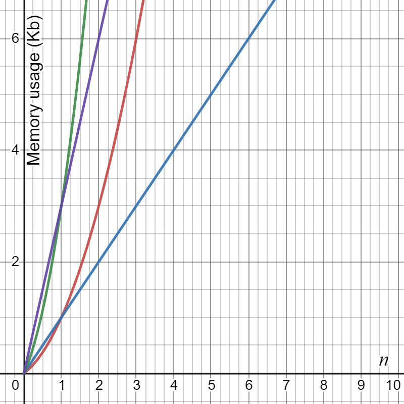

In the above graph, the red line represents the growth of memory usage for the first algorithm with a buffer size of `1Kb`; the blue line shows the growth of memory usage for the second algorithm with a `1Kb` buffer; the purple line is the first algorithm with a `3Kb` buffer and the green line is the second algorithm with a `3Kb` buffer. The graph shows that using the first algorithm with a small buffer size is significantly better than other combinations as the recursion depth increases.

## The Client

Now both endpoints of the system have the required bases to connect and securely communicate. The database allows user accounts to be logged into so that **CLUNKS** clients can interact with each other within the defined entities. To display this, we will now move onto the client:

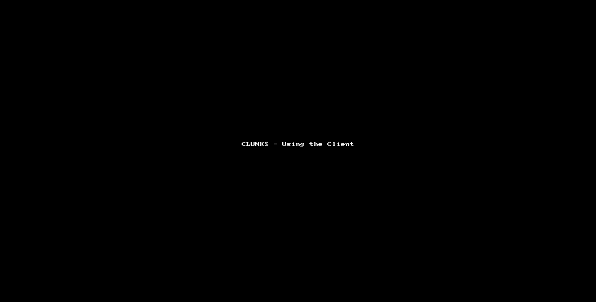

Here, a **CLUNKS** Client is being started up and logging into a user account on the connected server. After logging in, the client then connects to a subserver and begins to exchange messages with another user in the subserver.

The `Feed.Add` method (shown in the design) is called to store these messages. If the feed is alive, after adding the new message lines to `Feed.lines`, `Feed.Update` is called, which updates the feed to display the new messages:

```c#
private static void Update((int, int) original)
{
    int counter = 0;
    lock (lines)
    {
        if (size > lines.Count - pointer)
            Console.CursorTop = bottom - (lines.Count - pointer);
        else
            Console.CursorTop = top + 1;
        Console.CursorLeft = 0;
        foreach (List<KeyValuePair<string, ConsoleColor>> line in lines.Skip(pointer).Take(size).ToArray().Reverse())
        {
            if (counter == size)
                break;
            Console.Write(new string(' ', Console.WindowWidth));
            Console.CursorTop--;
            foreach (KeyValuePair<string, ConsoleColor> entry in line)
            {
                Console.ForegroundColor = entry.Value;
                Console.Write(entry.Key);
            }
            Console.SetCursorPosition(0, Console.CursorLeft == 0 ? Console.CursorTop : Console.CursorTop + 1);
            counter++;
        }
        Console.ResetColor();
        Console.SetCursorPosition(original.Item1, original.Item2);
    }
}
```

The method here manipulates the position of the console's cursor, to have row by row access to the lines within the console so that the message lines can be printed as a continuous feed directly out of the list `lines`. The conditions at the start of the method are used to initialise the position of the cursor in the printed feed so that lines will fill the feed from the bottom upwards (newer lines at the bottom) and if the number of lines stored is less than the size of the feed, then the messages will stick to the bottom of the feed, rather than the top. The method then moves on, iterating through the available lines and displaying their contents on the console until it the feed is filled or there are no lines left.

Another key feature shown in the gifs above is the user's ability to connect to different entities. The process of connecting to entities is referred to as *'entity traversal'* - this is a key part of using **CLUNKS**. There are two directions for entity traversal:
- Positive (traversal into an entity that is not in the user's current trace)
- Negative (traversal into an entity that is in the user's current trace)

With this in mind, there are also types or *'orders'* of entity traversal, being:
- Single (traversal into the direct child or parent of the current entity)
- Skipping (traversal into a distant entity or different branch of entities)

To demonstrate this, consider the following `.exp`:
```xml
<?xml version="1.0"?>
<root>
  <subservers>
    <subserver name="ss1">
        <room name="r1" password="">
            <room name="r2" password=""/>
        </room>
    </subserver>
    <subserver name="ss2"/>
    </subserver>
  </subservers>
  <globalUsers>
    <user username="u1" password="" sectors="user" global="True" elevation="user_elv"/>
    <user username="u2" password="" sectors="user" global="True" elevation="user_elv"/>
  </globalUsers>
  <elevations>
    <elevation name="user_elv" privilege="511" sectors="user"/>
  </elevations>
</root>
```

If the user `u1` desired to connect to `ss1` could do so with the `connect` command, and this would be considered a single, positive entity traversal. From here they can connect to `r1` which would also be a single positive traversal. If the user connected directly to `r1`, the action would be a skipping positive traversal. When connected to `r1` the user could perform a single negative traversal by connecting back to `ss1`or they could perform a skipping positive traversal by connecting to `ss2`. Likewise, a skipping negative traversal would be the traversal of `r2` to `ss1`.

On the client entity traversal is initially performed with the following code (simplified):

```c#
if (!(traversalTrace.Count == 0))
    if (entity == traversalTrace.Peek())
    {
        Console.WriteLine($"Already connected to {entity}");
        prompted = false;
    }
if (username == null)
{
    Console.WriteLine("You must log into an account before connecting to entities");
    prompted = false;
}
outPacket = new Packet(DataID.Command, channel.id);
if (traversalTrace.Contains(entity))
    outPacket.Add(Communication.CONNECT, Communication.START, entity, username, Communication.BACKWARD, String.Join(" - ", traversalTrace));
else
    outPacket.Add(Communication.CONNECT, Communication.START, entity, username, Communication.FORWARD, traversalTrace.Count == 0 ? String.Empty : traversalTrace.Peek());
channel.StatusDispatch += ConnectReponseHanlder;
channel.Add(outPacket);
Console.WriteLine($"Requesting CONNECT to '{entity}'...");
```

This code creates the `Packet` used to store the request data to be sent from the client. Upon reception of the `Pcakcet`, the server will switch through blocks of selective statements that define the behaviour of the response of the request. The simplest type of `connect` for the server to handle is any type of negative traversal, because passwords are not required for moving out of entities, only moving into new ones. Likewise, since negative traversal is to do with entities that have already been connected to, the user has already entered the password (if needed) for these entities anyway. This is action is reflected in the server by simply updating the correct `present` values of the database and logging the traversal to the log sink:

```c#
string[] trace = values[5].Split(" - ").Reverse().ToArray();
int i;
for (i = trace.Length - 1; i >= 0; i--)
{
    if (trace[i] == values[2])
        break;
    DBHandler.DBHandler.SetPresent(trace[i], values[3], false);
    logger.LogInformation($"User@{e.client.endpoint} ({values[3]}) logged out of '{trace[i]}'");
}
outPacket.Add(Communication.SUCCESS, String.Join(" - ", trace.Take(i + 1)));
```
*Where `values = ["CONNECT", "START", entity, username, "BACKWARD", userTrace]`*

This functionality becomes much more complicated when the user is traversing positively. In this case, the server needs to keep track of the passwords that the user needs to enter for all the entities they are skipping through, to make sure that the user is authorised for access throughout the branch. Much of this is performed by the server on the initial request for traversal, in preparation for the stages to come. After working out the entities that require passwords, the client and server engage in roundtrips with the server sending responses to prompt the client to enter these passwords one by one until the final password is successfully entered, in which case the server will update the database and respond to the user with a success message. The initial part of this process is performed by the following code:

```c#
state = DBHandler.DBHandler.UserInEntity(values[2], values[3]);
if (state)
{
    string next = String.Empty;
    string[] targetTrace = DBHandler.DBHandler.Trace(values[2]).Split(" - ");
    if (String.IsNullOrEmpty(values[5]))
        values[5] = targetTrace[0];
    string[] currentTrace = DBHandler.DBHandler.Trace(values[5]).Split(" - ");
    if (!currentTrace.SequenceEqual(targetTrace))
    {
        DBHandler.DBHandler.SetPresent(targetTrace[0], values[3], targetTrace[0] == currentTrace[0]);
        e.client.data["toUnset"] = String.Join(" - ", currentTrace.Where(entity => !targetTrace.Contains(entity)));
        if (targetTrace.Contains(values[5]))
            targetTrace = targetTrace.SkipWhile(entity => entity != values[5]).Skip(1).ToArray();
        e.client.data["requiresPassword"] = String.Join(" - ", targetTrace.Where(entity => !currentTrace.Contains(entity)));
        e.client.data["makePresent"] = String.Join(" - ", targetTrace);
        e.client.data["ETTarget"] = values[2];
        e.client.data["ETTargetSubserver"] = targetTrace[0];
        foreach (string entity in targetTrace.Reverse())
        {
            string pwd = DBHandler.DBHandler.GetEntityPassword(entity);
            e.client.data[entity] = pwd;
            if (!String.IsNullOrEmpty(pwd))
            {
                state = false;
                if (String.IsNullOrEmpty(next))
                    next = entity;
            }
        }
    }
```
*Where `values = ["CONNECT", "START", userTargetEntity, username, "FORWARD", userCurrentEntity]` and `state` is a boolean defined outside the scope of this snippet*

First, the database is queried to find if the user is actually on the member list of the entity they are attempting to connect to. If they are, the server moves on to initialise the `next` variable, a string to store the name of the next entity the user needs to provide a password for. The trace of the target entity is then calculated. If the user currently isn't connected to any entities, the user's current entity is set to the subserver of the target entity's trace, since the subserver can't have passwords anyway and a value is needed for later comparisons. After this, the current trace of the user is calculated and compared to the target trace. If the two traces are equal it means that the user was attempting to connect to a subserver, after previously not being connected to anything. We know this because the client prevents the user from positively traversing to already connected entities. Because of this, for the server to be in this block of the code at all, the user must have originally had no current entity, then was assigned the current entity of the subserver of the target trace. Since the current trace is only one entity (the assigned subserver), for the target trace to be equal to the current trace, the target trace must also only contain the assigned subserver. In this case, there are no passwords required so the server can skip the password finding block.

Otherwise, the server will update the database to set the `present` field to true for the user and create an entry `toUnset` in the data dictionary of the `ClientModel` being used to represent the client to store the trace of all the currently connected entities that aren't in the target trace. This entry is used to unset the presence of the user for all these entities so that if they change branch they arent left present on entities of the old branch. `requiresPassoword` is an entry holding the entities of the target trace that haven't been connected to yet. Note that some of these entities may not require a password, this is simply a list of all the entries that *could* require a password. `make` present is created to store the entities that should have `present` values updated on successful traversal, and the `ETTarget`/`ETTargetSubserver` entries hold data about the target entity.

After populating the dictionary, the server iterates over a list of the entities in the target trace, collecting their passwords out of the database as it goes. This is used to compare passwords sent later on by the user, instead of re-querying the database to get the passwords each time. The `next` variable holds the name of the lowest child in the trace that requires a password. `state` is used to decide if the user has already completed their traversal. If `state` is true, then there were no entities in the target trace that required a password so the traversal can be completed in this roundtrip, otherwise, an `INCOMPLETE` signal is sent back to the client, prompting them to enter the password for the entity stored in `next`. In the case that the traversal was complete, the database is updated and the client data dictionary is cleared:

```c#
if (state)
{
    if (!currentTrace.SequenceEqual(targetTrace))
    {
        foreach (string entity in e.client.data["requiresPassword"].Split(" - ").Where(x => !String.IsNullOrEmpty(x)))
        {
            DBHandler.DBHandler.SetPresent(entity, values[3]);
            logger.LogInformation($"User@{e.client.endpoint} ({values[3]}) logged into of '{entity}'");
        }
        e.client.data.Remove("requiresPassword");
        foreach (string entity in e.client.data["toUnset"].Split(" - ").Where(x => !String.IsNullOrEmpty(x)))
        {
            DBHandler.DBHandler.SetPresent(entity, values[3], false);
            logger.LogInformation($"User@{e.client.endpoint} ({values[3]}) logged out of '{entity}'");
        }
        e.client.data.Remove("toUnset");
        DBHandler.DBHandler.SetPresent(e.client.data["ETTargetSubserver"], values[3]);
        e.client.data.Remove("ETTargetSubserver");
        e.client.data.Remove("makePresent");
        e.client.data.Remove("ETTarget");
    }
    DBHandler.DBHandler.SetPresent(values[2], values[3]);
    logger.LogInformation($"User@{e.client.endpoint} logged into '{values[2]}' with username='{values[3]}'");
    outPacket.Add(Communication.SUCCESS, DBHandler.DBHandler.Trace(values[2]));
}
else
    outPacket.Add(next, Communication.INCOMPLETE);
}
```

The server resposnes (for `connect` requests) are handled by the following event handler on the client:

```c#
private static void ConnectReponseHanlder(object sender, PacketEventArgs e)
{
    string[] values = e.packet.Get();
    if (Communication.STATUSES.Contains(values[0]))
    {
        Console.WriteLine($"CONNECT completed with status '{values[0].ToUpper()}'.");
        if (values[0] != Communication.FAILURE)
            traversalTrace = new Stack<string>(values[1].Split(" - "));
        channel.StatusDispatch -= ConnectReponseHanlder;
        prompted = false;
        pass = true;
    }
    else
    {
        Packet outPacket = new Packet(DataID.Command, channel.id);
        pass = false;
        outPacket.Add(Communication.CONNECT, ConsoleTools.HideInput($"Enter '{values[0]}' password"), username);
        channel.Add(outPacket);
    }
}
```
*Where `values = [entityName, "INCOMPLETE"] OR [STATUS]` where `entityName` is the name of the entity requiring a password and `STATUS` is a final status of the operation*

As you can see, this handler will repeatedly prompt the user for passwords for as long as the server asks for one. The passwords are then sent to the server and handled by:

```c#
state = true;
List<string> trace = e.client.data["requiresPassword"].Split(" - ").ToList();
bool broke = false;
string currentEntity = String.Empty;
string next = String.Empty;
for (int i = trace.Count - 1; i >= 0; i--)
{
    currentEntity = trace[i];
    string pwd = (string)e.client.data[currentEntity];
    e.client.data.Remove(currentEntity);
    trace.RemoveAt(i);
    if (!String.IsNullOrEmpty(pwd))
    {
        state = BCrypt.Net.BCrypt.Verify(values[1], pwd);
        broke = true;
        if (i > 0)
            for (int x = 1; i - x < 1; x++)
            {
                next = trace[i - x];
                if (!String.IsNullOrEmpty((string)e.client.data[next]))
                    break;
            }
        break;
    }
}
```

The code here is responsible for verifying the passwords sent by the server and setting `next` to prompt the user for the next entity they need a password for. This is done by iterating through the trace stored in `requiredPassword` backwards so that indexing errors won't occur when items are removed from the trace. After this, if `state` is true then either the provided password was correct and the user should be prompted for the new one, or there were no more entities that needed passwords. This is why `broke` was introduced, to represent if the iteration was broken (meaning that a password was was checked). Therefore if both `state` and `broke` are true, the current stage of the traversal is complete, however, if `state` is true and `broke` is false, the provided password was true and there may be more to be entered. This can be seen in this code:

```c#
if (state)
{
    if (broke && trace.Count > 0)
    {
        e.client.data["requiresPassword"] = String.Join(" - ", trace);
        outPacket.Add(next, Communication.INCOMPLETE);
    }
    else
    {
        e.client.data.Remove("requiresPassword");
        foreach (string entity in e.client.data["makePresent"].Split(" - ").Where(x => !String.IsNullOrEmpty(x)))
        {
            DBHandler.DBHandler.SetPresent(entity, values[2]);
            logger.LogInformation($"User@{e.client.endpoint} ({values[2]}) logged into of '{entity}'");
        }
        e.client.data.Remove("makePresent");
        foreach (string entity in e.client.data["toUnset"].Split(" - ").Where(x => !String.IsNullOrEmpty(x)))
        {
            DBHandler.DBHandler.SetPresent(entity, values[2], false);
            logger.LogInformation($"User@{e.client.endpoint} ({values[2]}) logged out of '{entity}'");
        }
        e.client.data.Remove("toUnset");
        DBHandler.DBHandler.SetPresent(e.client.data["ETTargetSubserver"], values[2]);
        e.client.data.Remove("ETTargetSubserver");
        outPacket.Add(Communication.SUCCESS, DBHandler.DBHandler.Trace(e.client.data["ETTarget"]));
        e.client.data.Remove("ETTarget");
    }
}
```

Otherwise if `state` is false, then the password verification failed, seen in the `else` block of the statement:

```c#
else
{
    e.client.data.Remove("presentChanged");
    e.client.data.Remove("requiresPassword");
    e.client.data.Remove("ETTarget");
    e.client.data.Remove("toUnset");
    foreach (string entity in trace)
        if (e.client.data.ContainsKey(entity))
            e.client.data.Remove(entity);
    outPacket.Add(Communication.FAILURE);
}
```

The event handlers are called back on response to each incoming packet from the remote endpoint so this process will continue until the user successfully enters all the passwords and completes the traversal, or the user enters an incorrect password and the traversal is failed.

## Dependencies

The program relies on some external packages to provide certain functionality. This section will explain these dependencies and how they work. Along with the external packages, there is some functionality provided by special C# assemblies that come in the standard library, they will also be mentioned.

### **Hosting and Logging:**

The `Server.Worker` uses `Microsoft.Extensions.Hosting` and `Microsoft.Extensions.Logging` to set up the hosted service (worker service) and provide logging out of that service. `Hosting` also allows dependency injection to be used in the program, without having to rely on assembly reflection. `Serilog` is used alongside `Logging` to for the logging of the server. `Serilog` is used to override and reconfigure the default logger used by `Logging` to redirect the sink to a more accessible file to the user.

### **Configuration:**

The server can be configured by the user by editing the `App.config`/`Server.dll.config` files in the server's directory. This functionality is provided by `System.Configuration.ConfigurationManager` which provides the configuration classes used by the server to interact with the configuration file. While this could be achieved manually by reading the file with a `Stream` reader object in the program, `System.Configuration.ConfigurationManager` is the recommended practice for providing external configuration to programs, since it loads the configuration file automatically to the specification that `.config` files should be arranged in. This makes reading connection strings or configuration elements easier in the program.

### **Database Handling:**

The server also includes `Microsoft.Data.Sqlite`. This exposes the classes and methods used by `Server.DBHandler.Cursor` to interact with the database. Other C#-Sqlite binaries are available, such as `System.Data.Sqlite`, but they are older and don't utilise the full extent of the new .NET functionality as well as `Microsoft.Data.Sqlite`.

### **Hashing:**

Hashing is achieved with two libraries in the program. The server uses `BCrypt.Net-Next` to hash and verify passwords that are sent to it, while ClunksEXP uses the `bcrpyt` package to hash user and room passwords when `.exp` files are being created.

### **GUI:**

ClunksEXP's GUI is written using widgets built on the classes provided by `tkinter`. These widgets are then styled by `tkinter.ttk` and `ttkthemes`. Image objects are handled with `PIL`.

### **ClunksEXP IO:**

ClunksEXP's temporary file saving uses the `tempfile` module to create temporary files on the system. These temporary files store data serialized by `pickle`. The `.exp` files are generated programmatically and exporting using the classes and functions exposed by `xml.etree.ElementTree`.


<br>

--------
<br>

# **CLUNKS** - The Testing

## CPU Performance - Thread Sleeping (on continuous threads)
When the `Common.Channels.ClientChannel` class was first created, it would use `Common.Helpers.ThreadHelper.GetECThread` to create and run threads that would run tasks endlessly. The idea of this was that data could be sent to the user at any time, so the socket would need to be constantly checked for new incoming data. During development, it was observed that the program was using a significant amount of processing power:

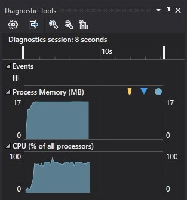
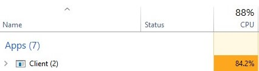

After some debugging the problem was identified to be caused by the ClientChannels threads constantly iterating millions of times per second. To solve this issue, the threads were paused for 10 milliseconds (per iteration) with `Thread.Sleep(10)`. This decreased the rate at which these threads were running by pausing the execution, and also allowing the OS's Task Scheduler to perform other work during this time. The reason the threads were using so much CPU prior to the change was that the Task Scheduler had no opportunity to switch between executing different threads, so they all had to be run at full power to make sure their job would be done. Now, with the threads now resting for 10 milliseconds each, the Task Scheduler can be more efficient with its resource allocation. These are the results of the change:

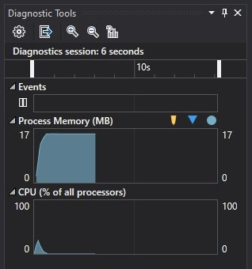
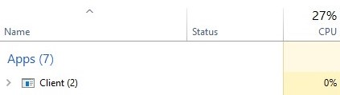

*NOTE: the program will be using more than 0% CPU but the value is so low that it is displayed as 0% in Windows Task Manager*

Even though 10 milliseconds seems to be such a minor change to be creating such a significant result, it is important to note that 10 milliseconds in modern CPU time is a very large span of time in which much can happen.

It also may have come to mind that if the threads are waiting for 10 milliseconds per iteration, they could potentially miss any information that is sent to the socket while the thread is asleep. Fortunately, for C# this is not the case. The C# socket class is based on the Berkley Socket Interface (originally implemented in C++) in which sockets communicate over a FIFO pipe created on the network. Any incoming data missed by the thread will be buffered by the pipe and can be collected when the thread resumes execution. Since the fastest that a thread will (most likely) ever need to run is around 30 iterations per second (since video calls often render frames at 30fps), the threads will have more than enough time to be able to sleep for 10ms and collect any missed data from the network pipe without introducing noticeable latency, whilst still minimising CPU usage.

## Entity Traversal

Entity traversal (achieved with the `connect` command) is the action of moving between different entities on the server. Much has to be taken into consideration on the server-side of this operation to make sure that everything is executed smoothly and cleanly while keeping the process simple for the client.

During the development of this feature, the client seemed to have serious issues with the changes being made and would output the message 'Connection the server has died' while the user was trying to enter their password to be sent to the server. This output is triggered when the `ClientChannel` detects a failure in its socket's connection to the server endpoint, so it disconnects itself to avoid any issues with damaged connections. One of the stranger things about this failure was that in the situation that the connection to the server dies, the client is supposed to output the failure message, then quit the program automatically, but in this case, the client seemed to be failing to quit and the program would hang.

To initiate the troubleshooting process, the server was investigated to see if it was crashing, since that was what the diagnostic scripts of the `ClientChannel` were reporting. After testing the issue, the problem was traced down to being caused by the server attempting to read packets from its client buffer while the buffers were still empty. Processing the empty buffers caused the method which builds byte streams into `Packets` to fail and seemed to fall in line with the reports from the `ClientChannel`.

To try and understand why this was happening, the network methods on the `ServerChannel` were tested extensively and after this, it was found that the buffers were empty because the 4-byte header being sent from the client to the server were also empty. Since bytes cannot be nullified, there's no way to programmatically distinguish between a null value and the value zero so the TCP listeners of the `ServerChannel` were interpreting the empty header as a valid header, which was evaluated to `0`, when it was in fact null. This was causing the buffers to be empty because the listeners were expecting zero bytes of incoming data.

To understand why the headers were empty, the network handling methods were tested further and it was later found that the headers were empty because the `ServerChannel`'s listening callbacks had been triggered after zero bytes had been read from the network pipe. Obviously this is a problem since the callbacks should only be invoked if there is data to be processed, even if it's only 1 byte, but zero should never happen. After some research on the documentation of the socket handling methods being used (`EndReceive`), the cause for this issue was found:

> *'If the remote host shuts down the Socket connection with the Shutdown method, and all available data has been received, the EndReceive method will complete immediately and return zero bytes.'* 

*(From https://docs.microsoft.com/en-us/dotnet/api/system.net.sockets.socket.endreceive)*

This indicated that even though the server was crashing, the root of the problem not originating from the server, but in fact was caused by the client disconnecting from the server for some reason. Turning the investigation to the `ClientChannel` now, the heartbeat system was identified as the culprit for the disconnection. The `ClientChannel` was for some reason not registering the heartbeats that were being sent to it by the server, causing the heartbeat system to believe that the connection to the server had died (and outputting the original 'Connection the server has died' message) and disconnecting itself as it's supposed to in that situation, however, the connection to the server hadn't died, and the logs from the server showed that the server was successfully sending heartbeat packets to the client, so why did the `ClientChannel` think that there weren't any heartbeats being sent? To understand this, the threads of the `ClientChannel` need to be analysed:

``` c#
Packet packet;
bool packetAvailable = inPackets.TryTake(out packet);
if (packetAvailable)
{
    if (packet.dataID == DataID.Heartbeat)
        receivedHB = true;
    else
        OnDispatch(packet);
}
```

The snippet above is a simplified sample of the dispatch method from the `ClientChannel`. It loops repeatedly on its own thread and is responsible for taking the incoming `Packet`s stored in `inPackets` and processing them accordingly. As you can see, if the incoming packet is identified as a heartbeat packet, a boolean flag is set to true to signify to the heartbeat system that a heartbeat has been received, otherwise, the packet is dispatched with the `OnDispatch` method. When `OnDispatch` gets called, it triggers the `ClientChannel.Dispatch` event so that any methods subscribed to the event will be invoked. For this situation the owner of the `ClientChannel`, `Client.Program` has a method `ConnectResonseHandler` subscribed to `Dispatch`, to process the `Status` packets and perform the client-side of the entity traversal process. A simplified sample of `Client.Program.ConnectResponseHanlder` is shown below:

``` c#
private static void ConnectReponseHanlder(Packet incomingPacket)
{
    string[] values = incomingPacket.Get();
    if (STATUSES.Contains(values[0]))
    {
        Console.WriteLine($"CONNECT completed with status {values[0]}.");
        channel.Dispatch -= ConnectReponseHanlder;
    }
    else
    {
        Packet outPacket = new Packet(DataID.Command, channel.id);
        Console.WriteLine($"Enter '{values[1]}' password");
        outPacket.Add(Communication.CONNECT, Console.ReadLine(), values[2]);
        channel.Add(outPacket);
    }
}
```
*`Packet.Get` is a method which outputs the data stored in a packet into an array, `channel` is the `ClientChannel` object*

The main thing to pay attention to here is the code in the `else` statement that prompts the user for input. This is where the root of the problem lay.

After diving back down into the documentation for the C# event system, it was discovered that C# events (by default) are synchronous. On its own, this isn't a problem, but when paired with the fact that the event handler waits for user input, the issue becomes clear. `ClientChannel` would trigger `Dispatch`, which would *synchronously* invoke the `ConnectReponseHanlder` which would wait for user input, causing the dispatch thread to get stuck on this line: `OnDispatch(packet)`, so it couldn't loop back around and execute `receivedHB = true` so the heartbeat system thought that no heartbeats had come in, causing the client to disconnect. However, when it disconnected it would attempt to quit the program but fail because the dispatch thread was still stuck, causing the console to hang as mentioned before.

Now that the main problem had been identified, it could be easily solved by making the event trigger with `OnDispatch` asynchronous by wrapping it with `Task.Run`, so that the dispatch thread would be free to move on after triggering the event.

## Message Feed
During the late development stages of the `Feed` class a problem was discovered that seemed to come out of nowhere, but had serious implications for the finalisation of the class.

*([commit 452623a](https://github.com/lembn/CLUNKS/blob/452623a7831a4658a4d038d629f810c1c3d9d227/.TestEnv/Program.cs) shows the state of the class at this point. Since the class was still in development at this point, it is in `.TestEnv.Program` and hadn't been intergrated into the Client yet)*

At this point in time, the `Feed.Save` method was being written to generalise the process of saving the feed messages rather than repeating the code in multiple places after its initial implementation, the program was run to test the new method but every time the method was called, the program would just quit and die. What was especially strange about this was that there were no errors thrown, which is very unusual for C# being that it is a very well documented and maintained language, so has few undefined behaviours. This is made the problem incredibly more difficult to solve, as there were no clues pointing to where the root of the problem may lie so really it could come from any part of the program.

First, the `Feed.Save` method was investigated, as that was what was new to the program, however, even though the `Feed.Save` method was new, the logic contained within it had already existed in the code in various other locations before it's creation. `Feed.Save` was only created to prevent having this duplicate code around the class (to make the code DRY), so it was quite peculiar for the method to behave like this when its contained code was performing fine before. Here is a sample of how `Feed.Save` looked (at the time of the issue):

```c#
private static int Save(List<List<KeyValuePair<string, ConsoleColor>>> linesToSave, int offset = 0)
{
    XDocument saveData = XDocument.Load(tempFile.FullName);
    foreach (List<KeyValuePair<string, ConsoleColor>> lineData in linesToSave.Skip(offset))
    {
        XElement current = new XElement("line");
        foreach (KeyValuePair<string, ConsoleColor> data in lineData)
            current.Add(new XElement("entry", new XAttribute("text", data.Key), new XAttribute("colour", (int)data.Value)));
        saveData.Add(current);
    }
    saveData.Save(tempFile.FullName);
    int savedLines = lines.Count;
    linesToSave.Clear();
    saved = true;
    return savedLines;
}
```

They key thing to see here is the first line:
```c#
saveData.Save(tempFile.FullName);
```
`tempFile` is an object storing some information about the temporary file that was created on the system to store message data. `saveData` is a C# LINQ object used to represent an XML document in the program. The program was failing at a point where `Feed.Save` should have been called, this means that any message data should have been saved into the temporary file by this line, however every time the program failed, the temporary file remained empty, suggesting that the program failed somewhere within this method, before this line. To watch what was happening, breakpoints were added into the method on its first line and the program was debugged from there.

Breakpoints allow a programmer to pause the program's execution on any line and analyse the state of any objects within the scope of the current stack frame. From there the programmer can release the program, allowing it to run at speed, or step through the program line by line and watch how the logic of the code affects the variables within it. In an asynchronous multi-threaded environment, this can be especially useful as a programmer is able to analyse the different call stacks of all running threads when the program is paused since they all belong to the same executable. Breakpoint debugging was heavily used when investigating this problem since with undefined behaviour like this, one of the only ways to gain an insight as to what is happening is to watch the code itself.

In this case, the breakpoint debugging identified that the program was dying on the first line of the method. Remember, no exceptions were thrown by any part of the program so there was still no insight as to why this was happening. After reading the docs for `XDocument.Load` and `FileInfo.FullName`, it clear that there was nothing wrong with the code on this line. To be sure of this, the code was copied and moved into a new test file, where it executed perfectly fine without error. This was strange behaviour so just to be sure, the automatic temporary file pattern was removed and replaced with manually creating a file in a created directory of the user's *special folder* for common application data - a more familiar design that could be trusted to always work.

When this new code also failed it was clear that `Feed.Save` was not causing the problem here, but rather that it was coming from elsewhere in the program. Analysing the call stack of the `Feed.Save` breakpoint showed that it was being called by `Feed.Deactivate`, a method on the `Feed` class used for deactivating the feed under certain conditions. This program was especially suspicious because before investigating `Feed.Deactivate`, console logs were added to all the other methods of the class to show whether or not they were running to completion (before the first and after the last line of each method) and `Feed.Deactivate` was the only one that logged getting in but never logged getting out. Here is a sample of the `Feed.Deactivate` code (at the time of the issue):

``` c#
private static void Deactivate(bool save)
{
    lock (isAlive)
    {
        if (!isAlive)
            return;
        if (deactivating)
            return;
        deactivating = true;
        sleeper.Cancel();
        PrintHeader(DEADFEED);
        isAlive = false;
    }
    lock (saveLock)
        if (save)
            saveCount = Save(lines, saveCount);
    deactivating = false;
}
```

First, the `isAlive` object is locked, to prevent any other methods from changing it while it is being used within this method. The first condition (`if (!isAlive)`) is a safety check to make sure the feed isn't already deactivated. Likewise, the second condition (`if (deactivating)`) is another safety to make sure a different thread doesn't deactivate the feed at the same time. Then `deactivating` is set to true (so that any other thread attempting to deactivate after this point in time will fail the second safety check) and an object called `sleeper` is cancelled. This here is the important line. When debugging this method with breakpoints, the program would run until `Save` was called, and then fail within `Save`. However, when the line `sleeper.Cancel();` was commented out, the program would run with the expected behaviour and the issue was gone. This means either `sleeper.Cancel()` was the cause of the problem or commenting out `sleeper.Cancel();` pushed the issue elsewhere into the program that wasn't being hit by the current tests. *Being pushed elsewhere would mean that the execution of `sleeper.Cancel()` was taking enough time that the program was caught by the crash while executing this line, and removing it would allow the program to escape this.*

`sleeper` is a C# `CancellationTokenSource`. `CancellationTokenSource`s contain `CancellationToken`s which can be used to asynchronously cancel a running thread from outside the thread. Here is a sample of the code that `sleeper` manages:

```c#
while (!sleeper.Token.IsCancellationRequested)
{
    if ((Console.CursorTop - bottom > Console.WindowHeight) && isAlive)
        Deactivate(true);
    else
        sleeper.Token.WaitHandle.WaitOne(3000);
    Thread.Sleep(10);
}
```

As you can see, the state of `sleeper`'s token's cancellation is repeatedly polled, and the code inside it is repeatedly executed for as long as the token remains uncancelled. The purpose of this loop is to detect if the current message feed is offscreen (if the user has scrolled so far from it that it is no longer visible in the console). The logic to achieve this can be seen in the `if` condition, where: `Console.CursorTop` is the (zero-based) row location of the cursor from the first row in the console and `bottom` is the (zero-based) row location of the bottom line of the fee

What matters here, is that if the feed is offscreen, `Deactivate` is called, otherwise, the loop should sleep for three seconds on `sleeper`'s `WaitHandle`. If `sleeper.Cancel` is called within those three seconds, the wait is interrupted and broken out of and the loop will continue on as if it had waited the full time. While removing `sleeper.Cancel` from `Deactivate` seemed to solve the problem, the unfortunate situation was that `sleeper` was needed, so it couldn't be removed. Furthermore, a very similar design pattern was used in the `Common.Channel` classes for their threads and was working fine, so it was strange that here `sleeper.Cancel` was causing issues.

Because of this, the class was tested relentlessly, adding log lines everywhere and commenting out every block of unnecessary code. This was so extreme that the program was only left with its synchronous, main-thread code uncommented by the end. The main thread code was run, just to make sure that it was 100% definitely not the cause of the problem but when it ran it executed, got in and out of all the called methods, then died. It was at this point that I realised what the cause of the problem really was.

Before adding the `Feed.Save` method, this code was present at the bottom of the `.TestEnv.Program.Main()`:

```c#
//keep-alive
Task.Run(() =>
{
    while (true)
        Console.Read();
});
```

This code spawns a new thread and makes it read input from the console's input buffer forever. While this may seem like it does nothing, it was responsible for keeping the program alive since it forced the program to constantly wait for new input, and as soon as it received some, it would wait for more. When `Feed.Save` was written, this code was removed from the class so technically there was nothing left to keep the program alive. This is what the reality of the *"problem"* was.

Since the `Feed` class is designed to be integrated into the Client, no means for keeping the threads alive after execution should be needed, as the Client should be responsible for keeping the program alive, however, during testing, the `Feed` class was being created in its own, independent environment so had to be responsible for keeping itself alive. Forgetting this, I had removed the "keep-alive" loop from the code leaving the program literally "hanging by a thread" as the only thing left keeping the program alive was the `while` loop responsible for detecting if the thread is offscreen (shown above).

When `sleeper.Cancel` was called this detection loop was broken out of and since there was nothing else left running in the program it would simply just quit, as it should. The program was never actually crashing, it behaving completely normally under the conditions that the code had put it in. This is why no errors/exceptions were thrown on fail. The reason it was failing after the `Feed.Save` breakpoint was that the breakpoint was allowing all the paths of execution to catch up to each other and synchronise, such that after the execution was released from the breakpoint, everything would end simultaneously. After discovering this the "keep-alive" was replaced into the program, and the `Feed` could be finalised, later to be integrated into the client.

<br>

--------
<br>

# **CLUNKS** - Evaluation

## Objective Review

### **Contain functionality that will allow users to communicate with each other via messages:**
The current version of **CLUNKS** is built on built around message-based communication which allows users to connect to the server and send messages over the entities defined on the server. The messaging services of **CLUNKS** work fully as originally designed so this objective can be considered to be completed. 
### **Provide a smooth user experience by utilising threads to distribute the workload across multiple asynchronous paths of execution:**
This objective has been achieved. The client and server are both written around C# threads and asynchronous callbacks with the intelligence to optimise the workload spread over the different threads. This provides the smooth user experience that was originally aimed for since the threading takes the programs long-running tasks away from the main thread that serves the user. Due to this, the only time factor (relative to the user) is the speed of the network.
### **Provide secure communication by encrypting all network traffic sent through it:**
The `Common.Packets` classes encrypt the byte streams that `Packet`s are serialized into during the serialization process. Since the `Common.Channel` classes exclusively use `Packet` objects to store data, the cryptographic support of `Common.Packets` is built into `Common.Channels` also. This shows that the objective has been accomplished since the client and server both utilise `Common.Channels` classes for communication.
### **Provide absolute confidence of integrity of data:**
This objective was achieved with the handshake performed by the client and server on connection. The design of the handshake ensures complete certainty that the remote endpoint is who they claim to be using the asymmetric certificate security.
### **Provide fast communication services:**
This objective has been partially completed. The main time factor within **CLUNKS** is the network speed and actions have been taken (like minimising the JSON used to store `Packet` data) to reduce bandwidth, however, despite this, there is only so much the program can do since network speed is an externally controlled factor.
### **Be a service that can run smoothly on any machine, regardless of its performance grade (within reason):**
Throughout the design and programming of **CLUNKS**, there is plenty of evidence to show that the system was built with performance in mind. This ensures that the objective is satisfied since memory and CPU usage has been considered at every step of the program.
### **Provide a flexible underlying codebase that can be expanded for more features in the future such as audio and video calling:**
This objective was also kept in mind while developing **CLUNKS**. This can be seen in the `Common.Channels.Channel` classes, where it is evident that the `Channel`s support both TCP and UDP, allowing for the potential usage of UDP for audio/video calling in the future. Furthermore the client and sever both define (currently empty) methods for handling `AV` `Packet`s, the `Packet` type that would be used to send audio/visual data across the system.
### **Provide an application allowing users to easily create and configure their server to their specific needs:**
ClunksEXP achieves both of these objectives, providing a user-friendly, GUI based application that will generate `.exp` files to the correct specification so that this process can be abstracted from the user. The ability to import and edit existing `.exp` files also shows this, as users won't always need to create their `.exp`s from scratch if their desired configuration is similar to an existing one.

## Future Improvements

- Custom Client Intergration
- Notifications
- Auio/Visual Support
- Encrypted Message Storage
- Automated Database Backups *(into `.exp` files)*
- User Logouts
- Up/Down Key History *(in client)*
- Info Commands
- Upgrade Client to .NET 5

## Overall Evaluation

Overall, I would consider the project to be very successful. All of the main objectives were completed, and most importantly there is a solid groundwork laid down that will allow future developments to be integrated while retaining the core of the program. **CLUNKS** seems to run well on different machines (but has not been tested outside of Windows) and ended up being everything it was designed to be. Looking reflectively on the project as a whole, it would definitely have benefited from more time for development, as there are most likely some bugs within the program that remain undiscovered but could be solved with some testing and diagnostic research. Alongside this, it would have been interesting to actually add the audio/visual features into the program. In terms of core functionality, the notification services were started but not completed, and still need to be written into the client. Furthermore, some more work needs to be added to fully support the custom client integration. Currently, there are some responsibilities written into the **CLUNKS** Client to protect the server, that may not be written into a custom client, presenting a potential flaw that can be exploited to damage the server. To solve this these responsibilities would need to be moved over onto the server so that the client won't need to declare them.
